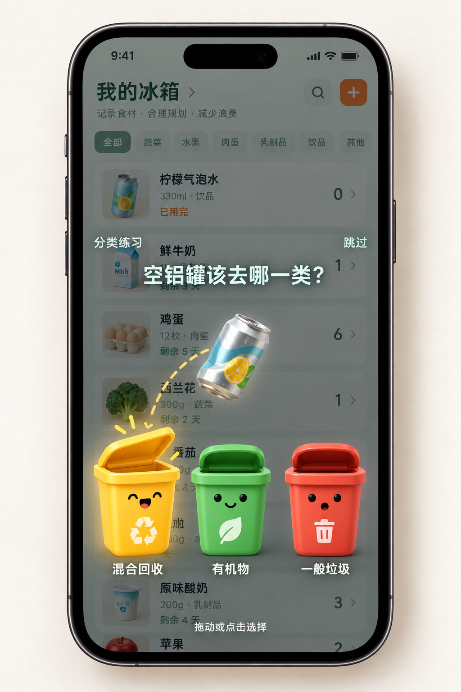
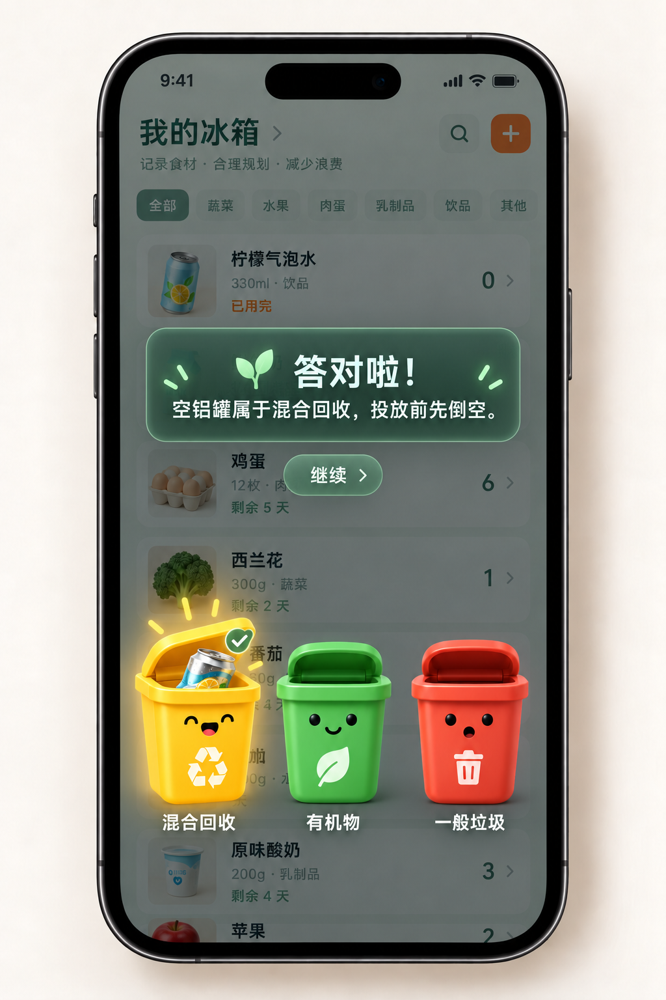
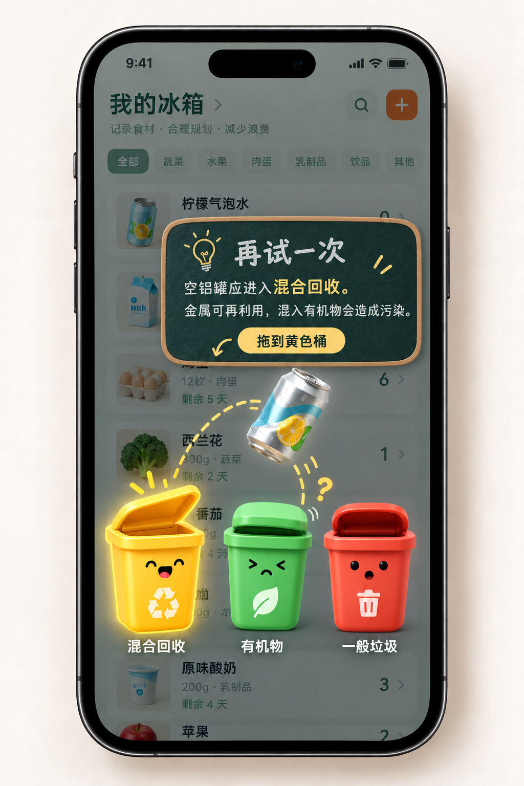

# KitchMemo 使用后分类小游戏方案

> 状态：产品方案与首版落地记录；迁移已在开发库验证，生产待部署  
> 日期：2026-10-02  
> 首版范围：维多利亚州与新南威尔士州；不依赖 council 的通用学习题；只记录学习结果

当前落地版使用项目已安装的 Material Design Icons 图标，配合 Expo 57 的手势与动画组件，不使用概念图里的 AI 绘制素材。首批真实题目为蛋壳、名称明确的铝罐与塑料瓶；未知材质的瓶装饮品在使用完后先让用户确认是否为硬塑料瓶，再进入题目。持久化包装档案和更多材质仍属后续版本。答错后展示正确类别与原因，记录本次学习选择；暂不提供同一事件的二次答题。悬浮层不使用白色底部面板。下文保留了完整产品愿景，其中飞出动效、重复题频控、二次答题与更广的素材库尚未落地。

## 1. 目标与边界

在用户使用库存物品、产生蛋壳或包装后，借一个短小的拖拽游戏教会用户识别废弃物类别。游戏记录的是**用户对分类知识的选择与学习**，不证明用户实际如何投放，也不计算垃圾减量、碳减排或金钱收益。

现有食物使用、丢弃、及时挽救及「已挽回价值」保持原有口径。分类学习在成就页有独立区域，不加入 `rescuedValue`。

首版不使用所在 council、GPS 或住址判题。题库只为维州和新州均有充分依据的材料给出确定答案。需要具体收集服务才能判断的题目只教材料类别，并明确提示实际投放应核对当地规则。

## 2. 核心体验

1. 用户在冰箱详情页保存一次真实的使用量减少；库存保存成功后，详情抽屉收起。
2. 若本次使用产生已知废弃物，物品图标轻轻飞出。问题、物品与分类目标直接悬浮在原冰箱页面上方，只用轻微暗化衬托，不出现白色或其他不透明底部面板。游戏加载失败或跳过均不回滚库存。
3. 页面显示一个可拖动的废弃物、简短提问、至多三个大型分类目标和「跳过」。用户也可直接点击目标。
4. 拖到目标上方时目标张嘴、放大并显示文字标签；松手后物品落入，随即给出反馈。
5. 首次选对：轻量祝贺，并用一句话解释；选错：物品弹回、说明原因、提供重试。不显示虚构的金钱损失或惩罚动画。
6. 完成或跳过后返回冰箱。若一次操作产生多个废弃物，保持同一轮游戏，逐个展示，不连续弹出多个全屏层。

文案示例：

- 提问：「这个空铝罐该去哪一类？」
- 正确：「答对了！空铝罐属于混合回收。投放前先倒空。」
- 错误：「再试一次。空铝罐应进入混合回收，混入有机物会造成污染。」
- 条件题：「蛋壳属于有机物。家里是否有接收食物残渣的桶，请查当地收集规则。」

首版游戏目标以**材料类别**标注，如「混合回收」「有机物」「一般垃圾」，而非承诺每户都有相同颜色的实体桶。投放建议与知识答案分开展示。存在多种有效路径时，接受所有有效答案；例如符合条件的饮料罐可回收，亦可能有容器返还路径。

## 3. 废弃物生成规则

库存计量单位不等于包装单位。规则应关联具体商品或确认过的商品预设，并注明废弃物部件与产生时机。

| 库存变化 | 已知废弃物 | 首版触发 |
| --- | --- | --- |
| 鸡蛋按「个」减少 2 | 蛋壳 ×2 | 一次使用操作合并为一轮题 |
| 一盒鸡蛋的最后一枚用完 | 蛋壳与纸蛋盒 | 只有确认包装为纸蛋盒及每盒数量时才加蛋盒 |
| 果汁按「瓶」减少 1 | 空瓶 ×1 | 已知瓶身材质时触发 |
| 果汁按「毫升」减少，但仍有余量 | 无确定的空瓶 | 不触发瓶子题 |
| 果汁按「毫升」降到 0 | 空瓶 | 已知包装数量和材质时触发；未知则不猜 |
| 按克／千克记录的散装商品 | 未知 | 不触发 |

同一材料可批量呈现，例如「蛋壳 ×3」。在分装、混合多瓶、部分包装提前丢弃等场景中，不依靠库存数量推断已产生的包装；后续版本可增加「包装已空」手动入口。

## 4. 出题频率与无障碍

- 同一次库存操作最多自动打开一轮。某种材料第一次出现时自动打开；之后默认显示小型「试试分类」入口，用户可主动重玩。频率在用户测试后调整。
- 游戏不应覆盖保存中状态，只在库存写入成功后出现。用户可立即跳过。
- 拖拽之外提供点击选择；屏幕阅读器读出废弃物名称、目标名称和反馈。文字不能仅靠桶颜色区分。
- 系统减少动态效果时，保留静态弹层、目标高亮和反馈文案，去除飞出、坠落与弹跳。

## 5. 规则与内容管理

每条题目至少保存：废弃物部件、材料类别、可接受答案、是否依赖本地服务、适用范围、简短解释、官方来源 URL、审核日期及规则版本。客户端只展示审核过的题目；AI 可以辅助识别候选包装，但不能直接生成权威正确答案。

首批建议：空铝罐、空钢罐、干净纸蛋盒、明确材质的硬塑料瓶；蛋壳作为「有机物类别」题。软塑料、复合饮料纸盒、玻璃瓶及瓶盖的具体投放去向需谨慎处理，不具备通用唯一答案时不作为实体桶判断题。维州与新州的 council 规则和家中服务会不同，尤其不能把绿色桶描述成所有家庭都有的厨余桶。[维州分类指南](https://www.environment.vic.gov.au/household-waste-recycling/sort-waste-recycling)、[NSW EPA 有机物指南](https://www.epa.nsw.gov.au/Your-environment/Recycling-and-reuse/household-recycling-overview/recycling-organics-home)

内容审核时分别核对两个州的官方资料；若出现冲突，题目降级为「需查看当地规则」或暂不展示。不要为追求题目数量扩大未审核的商品范围。

## 6. 数据与现有系统的衔接

- 库存 `consume` 事件仍是触发源。服务端在确认写入后创建可选的分类学习机会，返回事件标识、废弃物部件和题目；游戏不能自行修改库存。
- 每个「库存事件＋废弃物部件」只生成一次机会。保存首次选择、是否重试、完成或跳过、题目规则版本及操作者；重进页面或网络重试不能重复计数。
- 分类题目与尝试记录独立于 `inventory_events` 和食物价值流水。共享冰箱可展示家庭合计，尝试记录仍保留操作者，以便将来提供个人学习视图。
- 现有数量修改接口目前只返回批次状态，没有返回本次 `inventory_events.event_uid`；实施时需扩展原子操作及接口响应，保证触发与库存事件可靠关联。[当前数量接口](../server/src/routes/inventory.js)
- 若修改 Supabase schema、RPC、Express 库存路由或成就聚合，必须先完整阅读 `docs/data-architecture/BACKEND_DATA_CONTEXT.md`，通过新的时间戳 migration 保存数据库变化，先在开发／测试项目验证，最后更新数据上下文文档。

## 7. 成就与衡量

成就页增加独立的「分类学习」区块，展示：完成次数、首次答对次数、已学习的材料类别。答错后重试成功同样算完成学习，不扣既有 XP，不改变山峰等级、食物利用率或 `rescuedValue`。首版不展示「已回收多少件」或「减少多少排放」。

试点观察：游戏开启率、完成率、跳过率、按材料的首次答对率、错误解释后的重试率，以及重复题是否造成打扰。所有指标均称为学习行为，不称为实际回收成效。

## 8. 实施顺序与验收

1. 审核双州通用题库与废弃物素材，确定每题的来源和解释。
2. 增加包装／废弃物元数据、库存事件关联和幂等学习记录；用新 migration 完成数据库变化。
3. 在冰箱页实现飞出、拖拽、桶反馈、点击替代和静态减少动态效果模式。
4. 在成就页增加独立学习区块，完成共享冰箱聚合。
5. 用真实设备测试触摸命中、慢网络、较旧 Android、屏幕阅读器和中英双语。

首版必须通过的例子：一次使用 3 枚鸡蛋只出现一轮「蛋壳 ×3」；蛋盒仅在已知包装且整盒用完时出现；毫升果汁未归零不产生瓶子；未知材质不出题；答错可重试；库存保存与游戏失败互不影响；相同事件不重复记学习次数；蛋壳不会被判成所有地区都必须投绿桶；现有食物「已挽回价值」完全不变。

## 9. 概念图用途

当前版本把游戏元素直接悬浮在库存页面上；[上一版白色面板方案](art-direction/waste-sorting/minigame-concept-v1.png)仅保留作视觉对照。配套效果图仅用于评审视觉方向、版式和拖拽手势。它不是可运行界面，也不代表所有题目都能用固定的三个实体垃圾桶判对错。正式界面中的题目、来源、文字和目标类别以已审核的规则数据为准。图片生成记录见 [IMAGEGEN_PROMPT.md](art-direction/waste-sorting/IMAGEGEN_PROMPT.md)。

### 结果反馈状态

正确：铝罐落入目标，目标轻微发光；悬浮提示板给出一句原因，用户点击「继续」返回冰箱。

错误：铝罐弹回，错误目标停止响应，正确目标亮起；悬浮小黑板解释原因并邀请重试。错误仅代表本次学习选择，不推断现实中的实际投放，也不显示金钱损耗。
