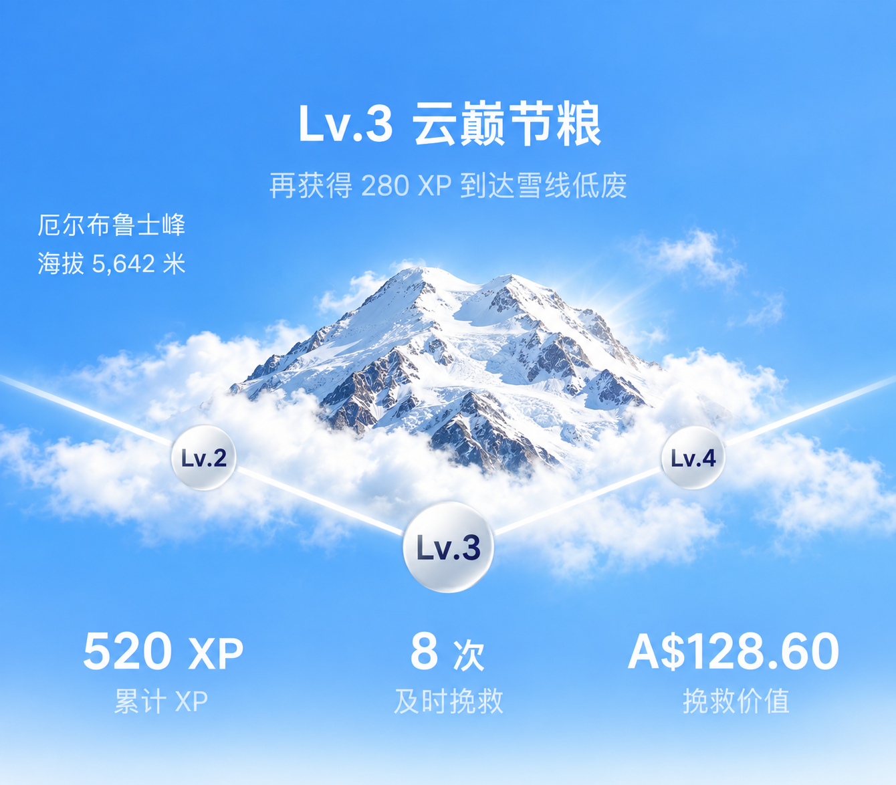
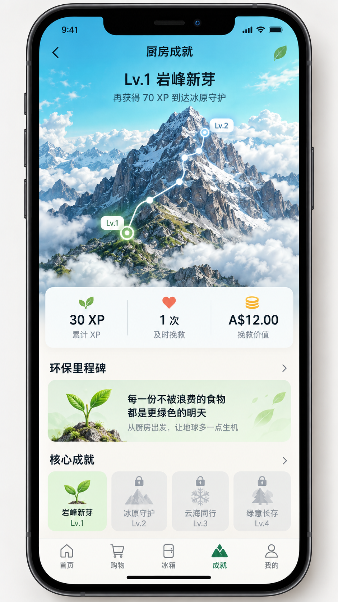
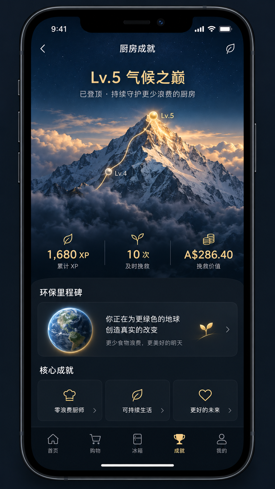

# KitchMemo 成就页山峰头部视觉与动效规格

> 状态：顶部等级区域已实现，支持五级预览切换
> 版本：0.3
> 最后更新：2026-09-12
> 适用范围：Expo 成就页顶部等级区域、五级山峰素材、等级进度与切换动效

当前实施边界只包含顶部等级区域：等级标题、升级文案、山峰名称与海拔、山峰和云层、V 形路线、相邻等级节点、三项数据。下方环保里程碑、成就卡片、XP 流水和底部导航保持现状，不在本轮重新设计。

## 1. 设计目标

成就页头部使用“攀登五座山峰”表达家庭持续减少食物浪费的过程。视觉可以参考旅行会员页中山峰、云海、路线和等级节点的空间关系，但不得直接复制第三方页面、图片、图标或动效文件。

目标：

1. 用户在 2 秒内看懂当前等级、升级距离和主要环境贡献。
2. 山峰是第一视觉焦点，数据服务于山峰叙事，不做普通仪表盘堆叠。
3. 五级使用同一视觉系统，但随等级逐步增加海拔、空间深度、光线和庄重感。
4. 动效表达“继续向上”，不制造游戏化焦虑，不因丢弃扣级或播放惩罚动画。
5. 所有等级、XP、金额和解锁状态由 `GET /api/achievements` 提供，客户端不复算权威结果。

## 2. 概念效果图

- `mockups/achievement-level-hero-lv3-focused.png`：本轮权威方向。只展示顶部等级区域，以 Lv.3 完整呈现前一、当前和后一等级节点。
- `mockups/achievement-hero-lv1.png`、`mockups/achievement-hero-lv5.png`：上一轮全屏探索稿，仅保留为过程记录，不作为当前页面改版范围。



以下全屏稿已停止推进：





效果图用于确认构图、色彩和信息层级，不是可直接发布的最终素材。正式实现需要把山峰、前后云层、路线和节点拆成独立资源。

## 3. 页面信息架构

顶部等级区域从上到下分为四层：

1. 等级文案：当前等级名称和升级提示；左侧显示山峰名称与海拔。
2. 山峰舞台：天空、山峰、前后云层、V 形路线与相邻节点。
3. 当前节点：位于 V 形最低点，前后等级分别位于左右两臂。
4. 环境贡献条：累计 XP、及时挽救批次、挽救价值。

推荐组件高度为屏幕宽度的 1.04–1.12 倍，约占常见手机可视高度的 46%–52%；山峰主体占组件宽度的 45%–58%。组件不自带状态栏、返回按钮、页面导航或下方内容卡片。

## 4. 权威数据映射

| 界面元素 | API 字段 | 展示规则 |
| --- | --- | --- |
| 真实当前等级 | `level.current` | 只由服务端决定，预览操作不得修改 |
| 可预览等级 | `levelCatalog` | 从数据库等级表返回五级代码、阈值、山峰键与主题键 |
| 等级名称 | `levelCatalog[].code` | 通过本地 i18n 映射，不能使用服务端英文键直接展示 |
| 预览山峰 | `levelCatalog[].mountainKey` | 选择正在查看等级的山峰资源包 |
| 预览主题 | `levelCatalog[].themeKey` | 选择正在查看等级的天空、文字和路线主题 |
| 累计 XP | `level.totalXp` | 千位分隔，不缩写为不明确的小数 |
| 升级提示 | `levelCatalog[].minimumXp - level.totalXp` | 低于当前等级显示“当前已高于该等级”；未来等级显示所需 XP；最高真实等级显示“已登顶” |
| 进度 | `level.progress` | 限制在 0–1，只影响路线高亮长度 |
| 前/当前/后节点 | `journey` | 缺失的前后节点不渲染 |
| 及时挽救 | `metrics.rescuedBatchCount` | 单位为“次”或“批次” |
| 挽救价值 | `metrics.rescuedValue` | 第一版固定 AUD；覆盖率低于 80% 时保留部分数据说明 |

头部不展示“购买金额减去过期金额”这种推导值。实际使用、及时挽救和丢弃价值继续遵守 `ACHIEVEMENT_BUSINESS_RULES.md` 的事件口径。

## 5. 五级视觉系统

| 等级 | 山峰 | 视觉主题 | 天空色 | 强调色 | 氛围 |
| --- | --- | --- | --- | --- | --- |
| Lv.1 岩峰新芽 | 查亚峰 | `tropicalBlue` | `#36BBDD → #8CE0E2` | `#EAF7D4` | 清晨、湿润薄雾、开始生长 |
| Lv.2 冰原守护 | 文森峰 | `polarBlue` | `#65B7E8 → #D6F2F4` | `#E9FDFF` | 冰川、清透冷光、稳定行动 |
| Lv.3 云巅节粮 | 厄尔布鲁士峰 | `cloudBlue` | `#3E91D7 → #B8DCE7` | `#FFF1C6` | 云海、明亮日光、持续积累 |
| Lv.4 雪线低废 | 乞力马扎罗峰 | `sunriseGold` | `#E8A04B → #F7D8A0` | `#FFF0BD` | 日出、暖金雪线、接近峰顶 |
| Lv.5 气候之巅 | 珠穆朗玛峰 | `summitNight` | `#081321 → #173A50` | `#F0C97B` | 深夜蓝、峰顶金光、安静庄重 |

五级共同使用：柔和颗粒、真实山体质感、半透明体积云、单条细路线、珍珠质感节点。避免霓虹、玻璃卡堆叠、紫蓝科技渐变和游戏排行榜风格。

## 6. 山峰舞台构图

### 6.1 图层顺序

从后到前：

1. `sky`：纯色渐变与极轻颗粒。
2. `atmosphere-back`：远景雾、光晕或低对比云。
3. `mountain`：透明背景山峰主体。
4. `cloud-back`：穿过山体中部的后云层。
5. `route`：从前一级经当前等级延伸到后一级的矢量路径。
6. `nodes`：前一等级、当前等级、下一等级节点。
7. `cloud-front`：遮挡山脚和部分路线的前云层。
8. `highlight`：最高等级可选的峰顶金色侧光，不应用于低等级。

云层实现采用两张可复用透明 PNG：后云位于山体后方，约 26 秒完成一次往返；前云位于山体和路线之间，约 20 秒完成一次反向往返。两层只使用 `translateX`、`scale` 和 `opacity` 的原生驱动动画；系统开启“减少动态效果”时保持静止。云层启用后不再叠加椭圆形背景提亮层，避免真机出现可见的弧形边界。

等级区域自身保持完整等级色，边界之后由当前预览等级的底色继续铺入内容区，并在第一张“环保里程碑”卡片背后约 260 dp 的范围内逐步过渡为页面浅色背景。渐变不覆盖指标文字，也不在等级区域内部提前变白。

### 6.2 节点关系

- 当前节点位于画面中心下方，直径 54–62 dp，文字权重最高。
- 前一级节点位于左侧上方，下一等级节点位于右侧上方，直径 38–44 dp。
- 已走过路线使用高亮色；未走路线使用 28%–40% 白色。
- Lv.1 不展示不存在的 Lv.0；Lv.5 不展示不存在的 Lv.6。
- 两侧节点可点击，山峰区域也可左右滑动并依次预览 Lv.1–Lv.5；两种交互都只改变本地画面，当前节点始终代表正在查看的等级，不修改服务端权威等级、XP 或解锁状态。
- 外层页面关闭顶部回弹与下拉刷新，避免顶部被下拉出空白区域。

## 7. 底部贡献条

等级区域底边使用一段短渐变过渡到页面背景色，渐变位于数据栏下方，避免白色指标文字失去对比度。数据栏采用紧凑排版：缩小数值与标签字号、降低分隔线高度，并减少整体纵向占用。

三列平均分布，不再使用独立小卡片：

| 位置 | 主值 | 标签 |
| --- | --- | --- |
| 左 | `level.totalXp` | 累计 XP |
| 中 | `metrics.rescuedBatchCount` | 及时挽救 |
| 右 | `metrics.rescuedValue` | 挽救价值 |

主值使用 24–30 sp，标签使用 11–13 sp。列之间只使用低对比分隔线，不使用三个浮动卡片。数值区域必须支持更长的本地化文本和四位以上金额。

## 8. 动效规格

### 8.1 页面首次进入

| 元素 | 初始状态 | 结束状态 | 时长 / 曲线 |
| --- | --- | --- | --- |
| 天空 | opacity 0 | opacity 1 | 280ms ease-out |
| 山峰 | opacity 0、scale 0.965、translateY 14 | opacity 1、scale 1、translateY 0 | 520ms cubic-bezier(0.22, 1, 0.36, 1) |
| 后云 | translateX -10、opacity 0 | translateX 0、opacity 0.78 | 620ms ease-out |
| 前云 | translateX 14、opacity 0 | translateX 0、opacity 0.92 | 720ms ease-out |
| 路线 | 0% 可见 | 当前进度长度 | 600ms ease-in-out，延迟 180ms |
| 当前节点 | scale 0.72、opacity 0 | scale 1、opacity 1 | 420ms 轻弹簧，延迟 360ms |
| 数据条 | translateY 8、opacity 0 | translateY 0、opacity 1 | 320ms ease-out，延迟 420ms |

云层进入后仅保留非常缓慢的 10–16 秒横向往返漂移，位移不超过 8 dp。页面离开前台时停止循环动画。

### 8.2 真实升级

真实等级发生变化时只播放一次：

1. 旧主题和新主题在 300ms 内交叉渐变。
2. 前云层在 420ms 内横向掠过，作为自然遮罩。
3. 旧山峰下沉 12 dp 并淡出，新山峰从下方 20 dp 上升进入。
4. 路线在 520ms 内延伸到新节点。
5. 新节点以一次轻弹簧点亮，不持续跳动。
6. 等级名称和底部数字在山峰稳定后更新。

总时长控制在 900–1200ms。丢弃事件不播放负面闪烁、破碎、倒退或降级动画。

### 8.3 减少动态效果

系统启用 Reduce Motion 时：

- 关闭云层循环、视差、路线绘制和数字滚动。
- 页面进入只做 180ms 淡入。
- 等级升级只做 240ms 交叉淡化。
- 业务内容、顺序和最终状态保持一致。

## 9. 素材清单与命名

建议目录：`src/assets/achievements/<mountain-key>/`

每座山峰至少包含：

```text
sky.webp
mountain.webp
cloud-back.webp
cloud-front.png
route.svg
preview.webp
```

要求：

- `mountain.png`、`cloud-back.png`、`cloud-front.png` 使用透明背景。
- 单层设计宽度以 1290 px 为基准，保证三倍移动端资源清晰度。
- 每个素材记录来源、生成方式、许可和修改日期。
- 正式资源不得包含第三方 Logo、水印、状态栏或文字。
- 首屏所有山峰资源建议压缩后合计不超过 1.2 MB；非当前等级延迟加载。

## 10. 响应式和安全区

- 设计基准：390 × 844 pt；同时验证 360 × 800 与 430 × 932。
- 顶部安全区由设备 Insets 决定，不把状态栏画入素材。
- 山峰主体以 `contain` 适配，允许天空扩展，不裁切主峰峰顶。
- 小屏优先减少山峰下方留白，不缩小主标题和核心数字。
- 横屏不作为第一版重点，但不得崩溃；可回退为较低高度的静态头部。

## 11. 无障碍

- 整个山峰舞台作为一个摘要区域朗读，不逐层朗读装饰素材。
- 推荐摘要：`当前等级 Lv.2 冰原守护，累计 130 XP，再获得 190 XP 升级。`
- 文本与动态背景保持至少 WCAG AA 对比度；必要时使用局部暗色或亮色柔和遮罩。
- 颜色不是唯一等级信息，始终同时显示等级数字和名称。
- 金额覆盖率不足时，屏幕阅读器也必须读出“基于部分已记录价格”。

## 12. 验收标准

- [ ] Lv.1 与 Lv.5 效果图完成团队评审。
- [ ] 五级素材均有明确许可或可追溯的生成记录。
- [ ] 所有山峰、云层、路线和节点可独立控制。
- [ ] 当前、前一和下一等级完全由接口数据决定。
- [ ] Lv.1/Lv.5 不出现不存在的相邻等级。
- [ ] 普通进入、真实升级和 Reduce Motion 三种动效均有实现。
- [ ] 动画不阻塞滚动、刷新或点击下方内容。
- [ ] 中英文、长金额、小屏和深色主题均通过视觉检查。
- [ ] 丢弃不会触发惩罚式动画，等级不会在界面中倒退。

## 13. 版权与交付边界

携程截图和录屏只作为团队内部的交互参考。KitchMemo 不提取、不描摹、不重新分发携程的山峰、云层、路线、节点、图标或页面截图。最终发布素材必须来自团队自制、明确授权图库或可追溯生成流程，并保留来源记录。

## 14. 本轮效果图生成记录

- 生成日期：2026-09-12。
- 生成方式：Codex 内置图像生成工具，新图生成模式；没有把携程截图作为编辑目标，也没有提取其中素材。
- Lv.1 提示词方向：单台完整手机、明亮矿物青蓝天空、写实岩峰、前后体积云、Lv.1 到 Lv.2 的攀登路线、30 XP / 1 次挽救 / A$12.00 三项数据、暖白内容面板、克制的绿色环境语言。
- Lv.5 提示词方向：与 Lv.1 相同的手机和产品系统、深夜蓝天空、写实雪峰、峰顶暖金侧光、Lv.4 到 Lv.5 的完成路线、1,680 XP / 10 次挽救 / A$286.40 三项数据、深色内容面板、无 Lv.6、无游戏式庆祝特效。
- Lv.3 聚焦稿提示词方向：只生成无手机外壳的顶部组件；严格采用山峰居中、云层横穿、左右路线汇聚到下方当前节点的 V 形结构；保留左侧山峰名称与海拔以及底部三列数据；删除所有下方卡片、导航和装饰图标。
- 原始生成结果保留在 Codex 生成目录；项目交付副本位于本文件第 2 节列出的 `mockups/` 路径。
