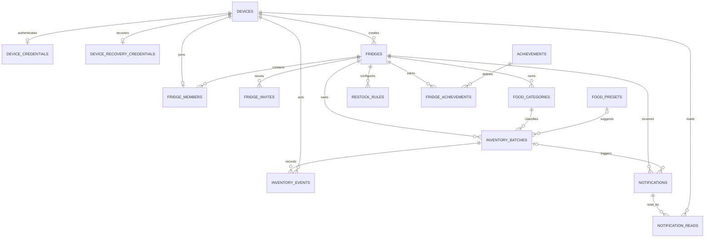

# KitchMemo 后端数据上下文

> 面向后续开发者和新的 Codex 对话。开始修改 Supabase、Express 数据接口、设备初始化、共享冰箱、库存、通知或成就功能前，请完整阅读本文档。

## 1. 当前状态

- 最后核对日期：2026-09-01（Australia/Sydney）。
- 当前数据库：Supabase PostgreSQL。
- 本地 schema 历史共有 12 份 migration。2026-09-01 开发项目已应用全部 12 份；生产项目的最新状态需在部署前远程核对。如果前三份共享同步 migration 已手动执行，继续应用 `20260901020000_shared_invite_join_errors.sql`；否则必须从缺失项开始严格按时间戳顺序部署。CLI 当前链接开发项目。
- 新增库存写入与库存详情 mutation migration 必须先在测试库应用和验证，再把同一文件应用到生产库。
- 远程 PostgreSQL lint 已通过，无 schema error。
- 应用最新本地 migration 后共有 17 张业务/安全表、7 个枚举，并新增设备凭证、恢复码、共享加入、退出与恢复 RPC，以及冰箱领域同步版本。
- Seed 现在包含 16 条常见食材建议和 4 条成就定义；新增的视觉识别食材需先应用 `20260831010000_upsert_photo_recognition_food_presets.sql` 才会出现在已部署环境。
- 前端的业务数据不会直连 Supabase；所有权威数据请求必须经过 Express。共享模式通过 Supabase Realtime Broadcast 接收不含业务记录的领域版本失效事件，随后静默重拉当前页面；30 秒版本探针和前台恢复对账负责补偿漏消息，Broadcast 未配置或断开时自动回退 6 秒探针。
- 代码中已实现设备凭证验证、设备初始化、库存读写、通知、购物清单、共享命名/开启、邀请码轮换、成员设备摘要、加入、退出和设备恢复；共享管理页面依赖 `20260831030000_manage_shared_fridges.sql`，必须先迁移数据库再部署新服务端。成就和分类管理接口尚未实现。

实际实现的权威来源：

- Schema 与数据库行为 migration：`supabase/migrations/` 下按时间排序的全部 SQL 文件

- Seed：`supabase/seed.sql`
- Express Supabase 客户端：`server/src/supabase.js`
- Express 入口：`server/src/index.js`
- Expo 设备标识：`src/services/deviceId.ts`
- Expo 通用请求层：`src/services/apiClient.ts`
- Expo 库存业务 API：`src/services/inventoryApi.ts`
- Expo 拍照识别 API：`src/services/recognitionApi.ts`
- Express 拍照识别代理：`server/src/routes/recognition.js`

本文档解释设计意图。字段或约束与本文档发生冲突时，以已部署 migration 为准，并同步更新本文档。

### Migration 保留规则（强制）

任何数据库结构或行为变化必须新增带时间戳的 SQL 文件到 `supabase/migrations/` 并提交 Git，包含表、字段、约束、索引、枚举、RLS、权限、触发器、RPC/函数、视图和 Storage policy。已经应用到任一远程环境的 migration 永远不能修改、删除或重命名；必须新增后续 migration。

不要把 Dashboard、Table Editor 或远程 SQL Editor 的改动当作完成。若已经直接修改远程项目，必须立即补写等价 migration 后再继续开发。测试环境验证通过后，生产环境只能应用同一份 migration；`seed.sql` 只放可复现的非用户参考数据，绝不放生产库存、设备、邀请码等用户数据。

## 2. 系统边界

```text
Expo App
  ├─ HTTP + Device-ID / Device-Credential
  │    └─ Express API / Vercel Function
  │         ├─ 业务数据接口
  │         └─ /api/sync/state（版本 + 共享频道会话）
  │              └─ server-only Supabase Secret Key
  │                   └─ Supabase PostgreSQL
  └─ Supabase Realtime（Publishable key + 256 位频道能力值）
       └─ 只接收领域和版本号，收到后回到 Express 读取权威数据
```

必须保持的规则：

1. Expo 环境变量只读取 `EXPO_PUBLIC_API_URL`；Realtime 的公开连接信息由已鉴权的 Express 同步会话下发。
2. `SUPABASE_SECRET_KEY` 或旧的 `SUPABASE_SERVICE_ROLE_KEY` 只能存在于 `server/.env`。
3. Expo 不得导入 `@supabase/supabase-js` 或创建 Data API client；仅允许 `@supabase/realtime-js` 连接 Broadcast，内存中只持有 publishable key 与当前冰箱高熵频道能力值，不持久化它们。
4. Express 使用 service role，因此会绕过 RLS。除公开健康检查和自带一次性恢复码验证的恢复接口外，每个业务接口必须验证 `Device-ID + Device-Credential`，再解析 `fridge_members`。
5. `created_by_device_id` 和 `actor_device_id` 只表示创建者或操作者；有效库存批次的个人所有权由 `owner_device_id` 表示，退出共享时随所有者设备迁移。没有个人所有者的派生数据仍由 `fridge_uid` 共同所有。
6. 同步探针不构成新的数据读取权限：请求必须通过相同设备凭证和 `authenticate_device`，响应只返回当前 `fridge_uid` 的模式与领域版本，不返回库存或成员记录。
7. Broadcast 只发送 `domain`、字符串版本号和时间戳，不发送库存、成员、通知正文或设备标识。频道名包含服务器生成的 256 位随机能力值，只通过已鉴权同步会话交给当前成员。

## 2.1 环境隔离与配置

- 测试与生产必须使用不同的 Supabase 项目、不同的 Express 部署/配置和不同的 `EXPO_PUBLIC_API_URL`。
- Expo 的公开环境变量只能包含 Express API 地址；绝不能包含 Supabase URL、Secret Key 或 service-role key。`SUPABASE_PUBLISHABLE_KEY` 只配置在 Express 环境，由已鉴权接口按需下发。
- Expo 本地开发使用根目录 `.env.development`，生产构建使用 `.env.production`（或 EAS 的对应环境变量）；两者只设置 `EXPO_PUBLIC_API_URL`。
- 本地 Express 默认读取 `server/.env.development`；当 `NODE_ENV=production` 时读取 `server/.env.production`。部署平台直接提供的环境变量优先于文件。
- Express 可用 `FOOD_RECOGNITION_API_URL` 覆盖视觉模型地址；该配置只存在于服务端，App 不直接调用模型。
- `server/.env` 仅作为旧开发机兼容回退。新配置请使用按环境命名的文件，所有真实 `.env` 文件都不得提交 Git。
- 测试 App 必须指向测试 Express，生产 App 必须指向生产 Express；同一 `device_id` 在两个 Supabase 项目中是彼此独立的数据。

## 3. Device ID 的真实格式

项目没有登录功能。`device_id` 是应用安装实例标识，不是用户账号；授权还必须匹配 SecureStore 保存的随机 `Device-Credential`。

当前 Expo 实现：

- iOS：首次生成 `ios_<UUID>`，保存到 SecureStore，后续复用。
- Android：读取系统 Android ID，形成 `android_<ANDROID_ID>`。
- Web：当前不支持，会抛出 `Unsupported platform`。

因此数据库中的所有 `device_id` 字段必须是 `text`，不能改成 PostgreSQL `uuid`。

已知限制：

- 更换设备后通常会得到新的 `device_id`。
- 当前没有跨设备恢复机制。
- 单独知道某个 `device_id` 不足以访问数据。首次请求会以 256 位随机凭证完成兼容认领，后续请求验证 SHA-256 摘要；恢复成功会撤销旧设备凭证并轮换恢复码。

## 4. 已确认的业务规则

1. 一台设备同时只能属于一个冰箱。
2. 冰箱可以是 `personal` 或 `shared`，两种模式使用同一张 `fridges` 表。
3. 多台设备通过邀请码加入同一个共享冰箱。
4. 加入共享冰箱时，加入方原个人冰箱的数据需要合并到邀请码目标冰箱。
5. 合并后，库存、分类、使用记录、通知事件和成就都按目标 `fridge_uid` 共享。
6. 通知内容按冰箱共享，但每台成员设备拥有独立的已读状态。
7. 成就属于整个冰箱，不属于单个设备。
8. 每次入库都创建独立库存批次。同名食材在不同日期入库不能合并为一行。
9. `chilled`、`frozen`、`pantry` 是保存的储存方式。
10. `expired`、`expiring`、`restock` 是计算状态，不是库存批次的固定类别。
11. 分类属于冰箱，因此共享成员可以同步看到自定义分类。
12. 常见食材建议是全局参考数据；用户确认后的储存方式和到期时间复制到库存批次，之后修改建议不会修改历史库存。
13. 每个库存批次保留 `owner_device_id`；加入共享不改变所有者，退出共享只迁移该设备拥有的有效批次。
14. 设备恢复不改写历史创建者或操作者，只转移当前所有权、成员关系和通知已读状态。
15. 创建家庭冰箱不是创建第二个并存容器，而是为当前个人冰箱命名、切换为 `shared` 并生成唯一有效邀请码；即使暂时只有一台成员设备，也处于等待家人加入的共享模式。

## 5. 实体关系图



## 6. PostgreSQL 枚举

| 枚举 | 值 | 用途 |
| --- | --- | --- |
| `fridge_mode` | `personal`, `shared` | 冰箱使用模式 |
| `fridge_status` | `active`, `merged` | 冰箱是否仍为有效数据归属 |
| `invite_status` | `active`, `used`, `revoked`, `expired` | 邀请码状态 |
| `storage_zone` | `chilled`, `frozen`, `pantry` | 实际储存方式 |
| `inventory_lifecycle` | `active`, `consumed`, `discarded`, `archived` | 库存批次生命周期 |
| `inventory_event_type` | `stock`, `consume`, `discard`, `adjust`, `merge` | 库存流水类型 |
| `notification_type` | `expiring`, `expired`, `restock`, `system` | 通知类型 |

## 7. 表结构

### 7.1 `devices`

匿名设备安装实例。

| 字段 | 类型 | 规则 |
| --- | --- | --- |
| `device_id` | `text` | 主键，长度 3–200 |
| `created_at` | `timestamptz` | 默认 `now()` |
| `last_seen_at` | `timestamptz` | 默认 `now()`；初始化 RPC 再次调用时更新 |

### 7.2 `fridges`

所有业务数据的顶层归属。个人与共享冰箱不分表。

| 字段 | 类型 | 规则 |
| --- | --- | --- |
| `fridge_uid` | `uuid` | 主键，自动生成 |
| `name` | `text` | 非空白 |
| `mode` | `fridge_mode` | 默认 `personal` |
| `created_by_device_id` | `text` | 外键 → `devices.device_id` |
| `status` | `fridge_status` | 默认 `active` |
| `merged_into_fridge_uid` | `uuid` | 自外键；合并后指向目标冰箱 |
| `created_at` | `timestamptz` | 创建时间 |
| `updated_at` | `timestamptz` | 由触发器更新 |

约束：

- `active` 冰箱的 `merged_into_fridge_uid` 必须为空。
- `merged` 冰箱必须保存目标 `fridge_uid`。
- 冰箱不能合并到自己。

### 7.3 `fridge_members`

设备与冰箱的成员关系。

| 字段 | 类型 | 规则 |
| --- | --- | --- |
| `fridge_uid` | `uuid` | 联合主键，外键 → `fridges` |
| `device_id` | `text` | 联合主键，外键 → `devices`，全表唯一 |
| `joined_at` | `timestamptz` | 加入时间 |

`device_id UNIQUE` 从数据库层保证一台设备同时只能属于一个冰箱。

### 7.4 `fridge_invites`

共享冰箱邀请码。

| 字段 | 类型 | 规则 |
| --- | --- | --- |
| `invite_uid` | `uuid` | 主键 |
| `fridge_uid` | `uuid` | 邀请目标冰箱 |
| `code` | `text` | 唯一，长度 6–64 |
| `created_by_device_id` | `text` | 创建邀请的设备 |
| `expires_at` | `timestamptz` | 可空，必须晚于创建时间 |
| `used_at` | `timestamptz` | 使用时间 |
| `status` | `invite_status` | 默认 `active` |
| `created_at` | `timestamptz` | 创建时间 |

`used` 状态必须有 `used_at`。每个冰箱只保留一个有效邀请码；重新生成会在同一事务中撤销旧码。加入会在数据库事务中完成个人冰箱合并。

### 7.5 `food_categories`

每个冰箱自己的分类集合，支持自定义分类。

| 字段 | 类型 | 规则 |
| --- | --- | --- |
| `category_uid` | `uuid` | 主键 |
| `fridge_uid` | `uuid` | 所属冰箱 |
| `name` | `text` | 分类名称 |
| `normalized_name` | `text` | 自动生成：`lower(btrim(name))` |
| `system_code` | `text` | 默认分类稳定键，可空 |
| `colour` | `text` | 前端颜色令牌 |
| `icon` | `text` | 前端图标名称 |
| `is_default` | `boolean` | 是否为系统默认分类 |
| `created_by_device_id` | `text` | 创建者设备 |
| `created_at` / `updated_at` | `timestamptz` | 审计时间 |

唯一约束：

- `(fridge_uid, normalized_name)`
- `(fridge_uid, system_code)`
- `(category_uid, fridge_uid)`，供库存批次使用组合外键

默认 `system_code` 必须与前端保持一致：

```text
meat, vegetables, fruit, staples, condiments, drinks, other
```

### 7.6 `food_presets`

全局常见食材储藏建议，不属于某个冰箱。

| 字段 | 类型 | 规则 |
| --- | --- | --- |
| `preset_uid` | `uuid` | 主键 |
| `canonical_name` | `text` | 唯一标准名称 |
| `normalized_name` | `text` | 自动生成并唯一 |
| `aliases` | `text[]` | 中英文别名，带 GIN 索引 |
| `suggested_storage_zone` | `storage_zone` | 推荐储存方式 |
| `suggested_shelf_life_days` | `integer` | 必须大于 0 |
| `suggested_category_code` | `text` | 映射默认分类 |
| `notes` | `text` | 储藏说明 |
| `is_enabled` | `boolean` | 是否继续提供建议 |
| `created_at` / `updated_at` | `timestamptz` | 审计时间 |

### 7.7 `inventory_batches`

真实库存核心表。每次入库新增一条批次。

| 字段 | 类型 | 规则 |
| --- | --- | --- |
| `batch_uid` | `uuid` | 主键 |
| `fridge_uid` | `uuid` | 数据所有权边界 |
| `category_uid` | `uuid` | 必须属于同一个 `fridge_uid` |
| `created_by_device_id` | `text` | 最初添加设备，仅用于审计 |
| `owner_device_id` | `text` | 当前设备级所有者；退出共享或设备恢复时迁移 |
| `preset_uid` | `uuid` | 可空；命中的全局建议 |
| `name` | `text` | 用户确认名称 |
| `normalized_name` | `text` | 自动生成，用于搜索和聚合 |
| `storage_zone` | `storage_zone` | 冷藏、冷冻或常温 |
| `initial_quantity` | `numeric(12,3)` | 必须大于 0 |
| `remaining_quantity` | `numeric(12,3)` | 0 到初始数量之间 |
| `unit` | `text` | 例如 `item`、`g`、`ml` |
| `purchase_price` | `numeric(12,2)` | 可空且不得为负 |
| `currency` | `char(3)` | 默认 `AUD`，三位大写代码 |
| `stocked_at` | `timestamptz` | 入库时间 |
| `expires_at` | `timestamptz` | 可空，不得早于入库时间 |
| `opened_at` | `timestamptz` | 可空，不得早于入库时间 |
| `lifecycle_state` | `inventory_lifecycle` | 默认 `active` |
| `version` | `integer` | 默认 1，用于共享编辑乐观锁 |
| `created_at` / `updated_at` | `timestamptz` | 审计时间 |

关键规则：同名食材可以有多个批次。前端允许聚合展示，但消耗、丢弃和到期计算必须落到具体 `batch_uid`。

当前详情修改约束：

- 数量不能小于 0，也不能超过该批次的 `initial_quantity`。
- 数量降到 0 时批次转为 `consumed`；从 0 增加时可恢复为 `active`。
- 修改请求携带 `expectedVersion`；版本不一致时 Express 返回 `409`，避免共享冰箱中的并发覆盖。
- 普通删除是软删除：批次转为 `archived`、剩余数量归零并保留流水，不物理删除历史记录。

### 7.8 `inventory_events`

不可替代的库存使用与变更流水。

| 字段 | 类型 | 规则 |
| --- | --- | --- |
| `event_uid` | `uuid` | 主键 |
| `fridge_uid` | `uuid` | 所属冰箱 |
| `batch_uid` | `uuid` | 必须属于同一个冰箱 |
| `actor_device_id` | `text` | 操作者设备，仅用于审计 |
| `event_type` | `inventory_event_type` | 入库、消耗、丢弃、调整或合并 |
| `quantity_change` | `numeric(12,3)` | 带符号数量变化 |
| `value_change` | `numeric(12,2)` | 默认 0，带符号价值影响 |
| `occurred_at` | `timestamptz` | 事件时间 |
| `note` | `text` | 可选原因或备注 |

建议约定：

- `stock`：正数量，价值影响通常为 0。
- `consume`：负数量；当前详情数量 mutation 按购买价比例记录同方向的带符号价值变化，成就统计实现前需统一“收益”展示口径。
- `discard`：负数量，价值影响为负浪费。
- `adjust`：数量和价值根据修正方向带符号。
- 更新 `inventory_batches` 和写入事件必须在同一事务中完成。

### 7.9 `restock_rules`

“需补货”筛选的规则来源。

| 字段 | 类型 | 规则 |
| --- | --- | --- |
| `rule_uid` | `uuid` | 主键 |
| `fridge_uid` | `uuid` | 所属冰箱 |
| `preset_uid` | `uuid` | 可空 |
| `normalized_item_name` | `text` | 标准化食材名称 |
| `minimum_quantity` | `numeric(12,3)` | 不得为负 |
| `target_quantity` | `numeric(12,3)` | 必须高于最低数量 |
| `unit` | `text` | 聚合时必须单位一致 |
| `is_enabled` | `boolean` | 是否启用 |
| `created_at` / `updated_at` | `timestamptz` | 审计时间 |

同一冰箱、食材/预设和单位只能有一条规则。

### 7.10 `notifications`

整个冰箱共享的通知事件。

| 字段 | 类型 | 规则 |
| --- | --- | --- |
| `notification_uid` | `uuid` | 主键 |
| `fridge_uid` | `uuid` | 所属冰箱 |
| `related_batch_uid` | `uuid` | 可空；必须属于同一冰箱 |
| `notification_type` | `notification_type` | 临期、过期、补货或系统通知 |
| `message_key` | `text` | i18n 文案键，不直接保存单一语言完整句子 |
| `message_payload` | `jsonb` | 食材名、剩余天数等模板参数 |
| `dedupe_key` | `text` | 全局唯一，防止同一事件重复生成 |
| `created_at` | `timestamptz` | 创建时间 |
| `expires_at` | `timestamptz` | 可空，必须晚于创建时间 |

### 7.11 `notification_reads`

每台成员设备独立的通知阅读状态。

| 字段 | 类型 | 规则 |
| --- | --- | --- |
| `notification_uid` | `uuid` | 联合主键，外键 → `notifications` |
| `device_id` | `text` | 联合主键，外键 → `devices` |
| `read_at` | `timestamptz` | 阅读时间 |

成员 A 写入阅读记录不会改变成员 B 的未读状态。

### 7.12 `achievements`

全局成就定义。

| 字段 | 类型 | 规则 |
| --- | --- | --- |
| `achievement_uid` | `uuid` | 主键 |
| `code` | `text` | 唯一稳定代码 |
| `title_key` | `text` | i18n 标题键 |
| `description_key` | `text` | i18n 描述键 |
| `rule_type` | `text` | 计算规则类型 |
| `threshold` | `numeric` | 可空且不得为负 |
| `is_enabled` | `boolean` | 是否启用 |
| `created_at` / `updated_at` | `timestamptz` | 审计时间 |

### 7.13 `fridge_achievements`

冰箱已经解锁的成就。

| 字段 | 类型 | 规则 |
| --- | --- | --- |
| `fridge_uid` | `uuid` | 联合主键 |
| `achievement_uid` | `uuid` | 联合主键 |
| `unlocked_at` | `timestamptz` | 解锁时间 |
| `metric_value` | `numeric` | 解锁时指标，可空 |

不保存 `device_id`，因为成就属于整个冰箱。

### 7.14 `shopping_cart_items`

共享购物清单。`fridge_uid` 决定列表归属；手动且未购买的条目使用 `owner_device_id`，可在所有者退出共享时随设备迁移。自动补货与通知生成条目没有个人所有者。

分类通过 `(category_uid, fridge_uid)` 组合外键保证与购物项属于同一冰箱。最新 migration 为该后加表补齐 RLS，并撤销 `anon`、`authenticated` 权限。

### 7.15 `device_credentials`

保存设备随机凭证的 SHA-256 摘要和 `active/revoked` 状态。App 原始凭证仅保存在 SecureStore，数据库、日志和响应不得返回原文。

### 7.16 `device_recovery_credentials`

保存一次性高强度恢复码摘要与轮换版本。恢复接口成功后立即生成下一枚恢复码；旧码和旧设备凭证同时失效。

### 7.17 `fridge_sync_versions`

保存每个冰箱的轻量变化埋点：`inventory_version`、`cart_version`、`fridge_version`、`notifications_version` 与唯一的 256 位 `broadcast_topic` 能力值。库存批次、补货规则、分类、购物项、共享成员/邀请/名称或通知表发生写入时，数据库触发器在同一事务中递增对应版本；共享模式还通过 `realtime.send` 发送对应领域和字符串版本号。客户端只比较版本；实际数据仍从原业务接口读取。

该表启用 RLS，移动端角色无权限，仅 service role 可读写。它不保存业务内容，也不是缓存数据库。

## 8. 派生状态

顶部筛选状态按以下方式计算：

| 筛选 | 规则 |
| --- | --- |
| 冷藏 | `storage_zone = 'chilled'` |
| 冷冻 | `storage_zone = 'frozen'` |
| 常温 | `storage_zone = 'pantry'` |
| 已过期 | `lifecycle_state = 'active' AND expires_at < now()` |
| 快过期 | 尚未过期且 `expires_at` 位于业务配置的提醒窗口内；当前前端原型使用 3 天 |
| 需补货 | 按食材和单位汇总有效批次后，小于或等于 `restock_rules.minimum_quantity` |

不要在库存批次中增加 `expired` 或 `expiring` 固定状态，否则时间推进后数据会失真。

## 9. 索引

已经建立的主要索引：

- 有效邀请码：`fridge_invites(code) WHERE status = 'active'`
- 冰箱分类：`food_categories(fridge_uid)`
- 食材别名：`food_presets USING GIN (aliases)`
- 有效库存筛选：`inventory_batches(fridge_uid, storage_zone, category_uid)`
- 到期查询：`inventory_batches(fridge_uid, expires_at)`
- 名称搜索/聚合：`inventory_batches(fridge_uid, normalized_name)`
- 冰箱流水时间线：`inventory_events(fridge_uid, occurred_at DESC)`
- 批次流水：`inventory_events(batch_uid, occurred_at DESC)`
- 通知时间线：`notifications(fridge_uid, created_at DESC)`
- 设备阅读记录：`notification_reads(device_id, read_at DESC)`

## 10. `bootstrap_device` RPC

签名：

```sql
public.bootstrap_device(
  p_device_id text,
  p_fridge_name text default 'My Fridge'
) returns uuid
```

行为：

1. 校验并写入 `devices`；已存在则更新 `last_seen_at`。
2. 如果该设备已有有效冰箱，直接返回原 `fridge_uid`。
3. 否则创建个人冰箱。
4. 创建唯一 `fridge_members` 关系。
5. 创建七个默认分类。
6. 返回新冰箱的 UUID。

这是 `security definer` 函数，但已经撤销 `public`、`anon` 和 `authenticated` 的执行权限，只授予 `service_role`。它只能由 Express 调用。

Express 已通过以下 HTTP endpoint 调用它：

```text
POST /api/devices/bootstrap
Device-ID: ios_... | android_...
```

## 11. 种子数据

`supabase/seed.sql` 当前包含：

- 16 种食材：tomato、banana、bittermelon、cucumber、eggplant、orange、papaya、pineapple、milk、egg、blueberry、rice、peas、soy sauce、yogurt、bread。
- 每种食材包含中英文别名、推荐储存方式、建议保质期和默认分类代码。
- 4 个成就：`first_item`、`waste_watcher`、`fridge_regular`、`shared_kitchen`。

视觉识别食材的参考值由 `20260831010000_upsert_photo_recognition_food_presets.sql` 同步到已部署项目。基础天数表示推荐储存方式下的最佳品质参考，不是食品安全保证；拍照识别会根据视觉新鲜度生成可编辑的预计到期时间，最终仍由用户确认。

Seed 使用 upsert，可重复运行。它不创建个人冰箱或默认分类；这些数据由 `bootstrap_device` 按冰箱创建。

## 12. 安全与权限

全部 17 张业务/安全表都已经启用 RLS。

当前权限策略：

- `anon`：无业务表权限。
- `authenticated`：无业务表权限。
- `service_role`：拥有业务表权限。
- 没有给移动端可使用的角色创建 RLS policy，因为移动端不直连 Supabase。

后果：RLS 不会替 Express 自动隔离冰箱，因为 service role 绕过 RLS。每个 Express 业务接口都必须执行：

1. 读取并校验 `Device-ID` 请求头。
2. 通过 `fridge_members.device_id` 取得唯一有效 `fridge_uid`。
3. 所有查询和写入都限定为该 `fridge_uid`。
4. 检查请求中的 `category_uid`、`batch_uid`、`notification_uid` 等是否属于同一冰箱。
5. 不接受客户端自由提交并覆盖 `fridge_uid` 或 actor device 字段。
6. 普通接口不得只相信 `Device-ID`；必须先通过 `authenticate_device` 验证 `Device-Credential`。恢复接口只能使用高强度一次性恢复码，并限制失败次数。

不要在日志、响应、代码或提交中输出 Supabase Secret Key。

## 13. 当前 Express 状态

`server/src/supabase.js`：

- 从 `SUPABASE_URL` 读取项目地址。
- 优先读取 `SUPABASE_SECRET_KEY`，兼容旧 `SUPABASE_SERVICE_ROLE_KEY`。
- 从 `SUPABASE_PUBLISHABLE_KEY` 读取可公开的 Realtime 连接 key；路由会拒绝把 secret/service-role key 当作公开 key 返回。
- 禁用 token 持久化和自动刷新。
- 只能被服务端模块导入。

`server/src/index.js` 已注册：

```text
GET /api/health
GET /api/sync/state
POST /api/devices/bootstrap
GET /api/fridges/context
POST /api/fridges/share
POST /api/fridges/invites
PATCH /api/fridges/current
POST /api/fridges/join
POST /api/fridges/leave
POST /api/devices/recovery-code
POST /api/devices/recover
GET /api/inventory
GET /api/food-presets/suggestion?q=<food-name>
POST /api/photo-recognition
POST /api/inventory/batches
GET /api/inventory/batches/:batchUid
PATCH /api/inventory/batches/:batchUid/quantity
PATCH /api/inventory/batches/:batchUid
PUT /api/inventory/batches/:batchUid/restock-rule
DELETE /api/inventory/batches/:batchUid
GET /api/notifications
POST /api/notifications/:id/read
GET /api/cart
POST /api/cart
GET /api/restock
```

该接口通过 Supabase Admin API 检查服务端连接，只返回：

```json
{ "status": "ok", "database": "connected" }
```

已实现：

- 设备 bootstrap：按 `Device-ID` 初始化并返回当前冰箱与默认分类。
- 库存读取：返回当前冰箱、分类、活跃批次与计算后的 `needsRestock`。
- 储藏建议：精确匹配 `food_presets.canonical_name` 或 `aliases`，返回建议储存方式、分类和保质期天数。
- 拍照识别：校验当前设备的冰箱成员关系后，在内存中把单张 JPEG、PNG 或 WebP 图片转发给视觉模型；限制 10 MB、模型超时 25 秒，图片不写磁盘、不进入 Supabase，也不记录图片内容。
- 识别预填：模型支持 banana、bittermelon、cucumber、eggplant、orange、papaya、pineapple、tomato，并返回 `fresh`、`semi_fresh` 或 `rotten`。前端用识别名称查询 `food_presets`，再以新鲜度调整基础保质期，仅预填可编辑表单且不会自动提交；未知结果、缺少预设或请求失败都允许回退手动填写。
- 手动入库：数据库函数在一个事务中创建库存批次、`stock` 流水和可选补货规则。
- 通知：打开列表时按当前库存同步临期、过期、补货提醒；已读写入 `notification_reads`，按设备独立。
- 共享与恢复：命名并开启共享、邀请码轮换、改名、加入、退出和设备恢复通过数据库原子函数完成；上下文返回当前有效邀请与匿名成员设备摘要。加入只接受单成员个人冰箱，退出带走当前设备所有的有效批次。
- 邀请失败状态：加入 RPC 会先读取邀请码真实状态，再分别返回 `invite_not_found`、`invite_expired`、`invite_used`、`invite_revoked`；Express 保留这些稳定错误码，Expo 负责显示对应中英文提示。只有格式错误或确实不存在的码显示无效/未找到。
- 前台静默同步：`GET /api/sync/state` 返回当前冰箱模式、四个领域版本，以及共享模式下的 Realtime endpoint、publishable key 和高熵频道能力值。数据库 Broadcast 变化后只通知当前已挂载页面静默重拉相关接口；连接正常时每 30 秒对账，未配置或断线时共享模式回退每 6 秒探测，个人模式保持 30 秒。App 回前台会重建频道并立即对账，网络错误最长 60 秒退避。该方案不依赖 Vercel Function 实例内存，也不需要 Redis。

尚未实现：

- 明确的丢弃（`discard`）入口
- 批次详情：返回单个活跃批次、当前版本及匹配的补货规则。
- 数量调整：原子校验版本、更新数量/生命周期并写入 `consume` 或 `adjust` 流水。
- 资料编辑：原子校验版本并修改名称、储存方式、分类、价格和到期等批次字段。
- 补货规则：按当前冰箱、标准化名称和单位新增或更新规则，也可关闭规则。
- 移出冰箱：软归档批次并写入调整流水，保留历史数据。

## 14. 建议的接口开发顺序

### 已完成：设备与冰箱上下文

```text
POST /api/devices/bootstrap
```

### 已完成：Fridge 页面读取与入库

```text
GET /api/inventory
POST /api/inventory/batches
```

### 已完成：拍照识别与可编辑预填

```text
POST /api/photo-recognition
GET  /api/food-presets/suggestion?q=<recognised-food>
```

识别接口只负责清洗模型响应，不把图片或新鲜度写入数据库。前端将 `fresh` 映射为完整建议保质期、`semi_fresh` 映射为向上取整的 40%、`rotten` 映射为最短复核时间，然后进入与手动添加相同的 `InventoryEntryFlow`。只有用户在共用表单中确认后，才会调用库存写入接口。

库存查询应支持：

- `q`：名称模糊搜索
- `storage`：`chilled` / `frozen` / `pantry`
- `status`：`expired` / `expiring` / `restock`
- `categoryUid`

储存筛选和分类筛选必须允许叠加。

### 已完成：通知列表与已读

```text
GET  /api/notifications
POST /api/notifications/:notificationUid/read
```

打开列表会调用 `sync_fridge_notifications`。通知正文用 `message_key` 加 payload，不在数据库存中英句子。
### 已完成：库存批次详情与修改

```text
GET    /api/inventory/batches/:batchUid
PATCH  /api/inventory/batches/:batchUid/quantity
PATCH  /api/inventory/batches/:batchUid
PUT    /api/inventory/batches/:batchUid/restock-rule
DELETE /api/inventory/batches/:batchUid
```

这些接口由 `20260830010000_inventory_detail_mutations.sql` 中的数据库函数保证数量更新与事件写入处于同一事务，并通过 `version` 做共享编辑冲突检测。前端详情弹窗调用 `src/services/inventoryApi.ts`，不得绕过 Express。

`20260830020000_fix_inventory_lifecycle_enum_cast.sql` 修复详情数量和资料 mutation 中 `lifecycle_state` 的枚举转换，必须在包含 `20260830010000` 的环境中继续应用。

### 已完成并在开发库验证：共享冰箱与设备恢复

```text
POST /api/fridges/share
POST /api/fridges/invites
PATCH /api/fridges/current
POST /api/fridges/join
POST /api/fridges/leave
POST /api/devices/recovery-code
POST /api/devices/recover
```

加入共享冰箱必须在单一事务中完成：

1. 锁定来源和目标冰箱。
2. 按 `normalized_name` 合并分类映射。
3. 迁移批次、流水和补货规则到目标 `fridge_uid`。
4. 同名批次保持独立。
5. 更新成员关系和目标模式。
6. 旧通知失效并按合并后库存重新生成。
7. 重新计算冰箱成就。
8. 标记来源冰箱为 `merged`。

退出共享会创建个人冰箱并迁移 `owner_device_id` 匹配的有效批次和未购买手动购物项；成就、其他成员物品、已完成购物项和历史无效批次保留在原共享冰箱。设备恢复会合并新设备临时个人冰箱、转移所有权与成员关系、撤销旧设备凭证并轮换恢复码。

开发库端到端验证覆盖：共享命名并开启、邀请码过期/已使用/已撤销/不存在的独立错误、邀请码轮换与旧码撤销、冰箱改名、两台个人设备分别入库、邀请码合并、共享库存可见、所有者退出拆分、第三台设备恢复、旧设备凭证撤销；验证脚本 `server/scripts/verify-sharing.js` 使用随机测试设备并在结束时按精确 ID 清理测试数据。

Expo 冰箱页左上角是共享功能唯一主入口：个人模式提供创建或输入邀请码；共享模式进入管理页。创建页支持自定义名称，分享页生成二维码并支持复制、系统分享和二维码图片分享，加入页支持手输或 Expo Camera 扫码。设置页只保留设备恢复码，避免共享操作分散在两个入口。

Expo 的全局 `RealtimeSyncProvider` 只在 App 前台维护一个共享冰箱 Broadcast 频道；系统进入后台会断开，恢复时重建频道并主动刷新库存、购物车、补货、通知、共享上下文和首页摘要。180ms 合并窗口避免一笔业务事务的多个事件造成重复读取，只有当前页面订阅对应领域，后台 Tab 不会产生多余业务请求。冰箱、购物车、补货列表支持手动下拉刷新，通知列表提供显式刷新按钮。

### 阶段五：成就

```text
GET /api/achievements
```

## 15. Migration 工作流

不要直接修改已经部署的 `20260829000000` migration。后续 schema 变化创建新的时间戳 migration。

常用命令：

```powershell
npx supabase migration new <change_name>
npx supabase db push --dry-run
npx supabase db push
npx supabase db lint --linked --level warning
npx supabase migration list
```

种子数据更新：

```powershell
npx supabase db push --include-seed
```

禁止对包含真实数据的远程项目执行 `supabase db reset --linked`，因为该命令会删除远程数据。

## 16. 新对话接手检查清单

新的开发对话开始处理数据端任务时，应按顺序确认：

1. 阅读本文档和当前 migration。
2. 查看 `git status`，保留组员未提交修改。
3. 查看 `server/src/index.js` 是否已经新增接口；本文档可能落后于代码。
4. 确认 `device_id` 仍为 text 格式。
5. 确认前端没有 Supabase client 或 key。
6. 所有业务访问都先由 Express 将设备解析到唯一 `fridge_uid`。
7. 所有库存修改同时写入 `inventory_events`。
8. 不把临期、过期保存成固定库存状态。
9. 通知事件按冰箱共享，已读状态按设备保存。
10. 库存所有权使用 `owner_device_id`，创建和操作审计字段不可因退出或恢复而改写。
11. 服务端部署依赖 `20260831020000`；数据库 migration 必须先在测试环境应用验证，再部署依赖新 RPC 的 Express 与 App。
12. 同步版本与 Broadcast 只做页面失效通知，业务记录仍从 HTTP API 读取；不得把 `fridge_sync_versions` 或 Broadcast payload 当作业务缓存。
13. 成就按冰箱保存。
14. Schema 变化使用新 migration，并同步更新本文档。
