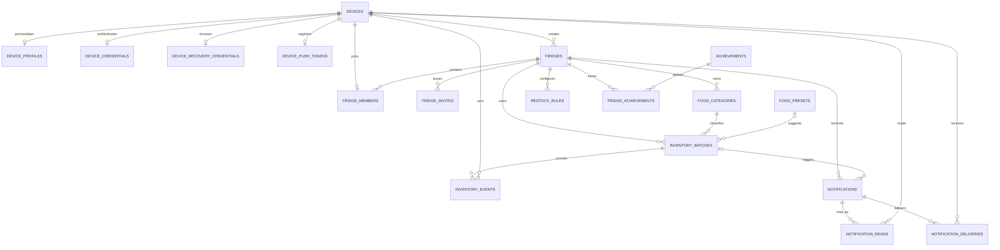

# KitchMemo 后端数据上下文

> 面向后续开发者和新的 Codex 对话。开始修改 Supabase、Express 数据接口、设备初始化、共享冰箱、库存、通知或成就功能前，请完整阅读本文档。

## 1. 当前状态

- 最后核对日期：2026-10-05（Australia/Sydney）。
- 当前数据库：Supabase PostgreSQL。
- 本地 schema 历史共有 49 份 migration。CLI 当前链接 `Gress-development`（thmbtsssvnslotoexntz）；开发库已登记并应用到 `20261005011000_learning_room_draft.sql`，Learning Room 298 次真实 HTTP 请求及版本／恢复 SQL 回滚验证通过。既有包装快照与多部件分类学习接口验证保留。生产库未应用本轮两份 learning migration，仍须按顺序补齐前置 migration 后才能发布依赖新契约的 Express 与 App。
- 新增库存写入与库存详情 mutation migration 必须先在测试库应用和验证，再把同一文件应用到生产库。
- `20260907010000_inventory_input_guardrails.sql` 已由项目负责人依次应用到测试库和生产库，为库存名称、剩余数量和单位增加数据库边界；使用 `NOT VALID` 保留历史异常记录，但所有新写入与后续修改都会立即受约束。
- 开发库远程 PostgreSQL lint 已通过，无 schema error；`20260910010000_fix_assistant_vector_operator.sql` 使用显式 `OPERATOR(extensions.<=>)` 修复空 `search_path` 下 pgvector 运算符无法解析的问题。
- 本轮远程只读核对 public schema 共有 44 张普通表，其中 Learning Room 新增 7 张；保留既有设备资料、Push Token、通知投递审计、设备凭证、恢复码、共享加入、退出与恢复 RPC、冰箱领域同步版本，以及成就等级和 XP 流水。
- Seed 现在包含 16 条常见食材建议和 4 条旧成就定义；`20260912020000_achievement_dashboard.sql` 会幂等扩充并统一为 8 条已确认成就定义。新增的视觉识别食材需先应用 `20260831010000_upsert_photo_recognition_food_presets.sql` 才会出现在已部署环境。
- 前端的业务数据不会直连 Supabase；所有权威数据请求必须经过 Express。共享模式通过 Supabase Realtime Broadcast 接收不含业务记录的领域版本失效事件，随后静默重拉当前页面；30 秒版本探针和前台恢复对账负责补偿漏消息，Broadcast 未配置或断开时自动回退 6 秒探针。
- 代码中已实现设备凭证验证、设备初始化、个人昵称、设备级通知偏好、共享库存事件通知、Expo 系统推送、库存读写、购物清单、共享命名/开启、邀请码轮换、具名成员摘要、加入、退出、设备恢复，以及已在开发库验证的成就聚合接口和真实数据页面。分类管理接口尚未实现；生产发布仍须先应用 `20260912010000` 和 `20260912020000`。
- 已在开发库和生产库应用的 `20260909010000_assistant_freshness_foundation.sql` 为助手日期语义建立向后兼容基础：新增硬性 `use_by_at`、系统计算的 `estimated_quality_until` 和版本化季节品质档案。它保留旧 `expires_at`，不把历史模糊日期自动升级成安全期限。`20260909020000_assistant_history_read_model.sql` 新增只对 service role 开放的个人/共享历史聚合 RPC，结果不返回真实设备 ID。`20260909030000_assistant_rag_foundation.sql` 使用 `text-embedding-3-small` 的 1536 维向量建立审核知识源、文档、分块和 RRF 混合检索函数。`20260909040000_assistant_conversation_audit.sql` 建立创建者私有会话、消息、脱敏审计、反馈与短时待确认动作。`20260910010000_fix_assistant_vector_operator.sql` 修复混合检索函数的向量运算符解析。`20260911010000_confirm_assistant_pending_actions.sql` 新增原子确认与取消 RPC，`20260911030000_link_assistant_actions_to_messages.sql` 将动作精确关联到产生它的助手消息，供历史恢复使用。Express 已实现 GPT-5.6 Luna 编排、只读工具、RAG、结构化校验、会话历史读取和显式确认；Expo 已接入自由输入、快捷问题、当前会话续接与历史恢复。数据库契约已经进入生产，但生产知识内容摄取、OpenAI 环境变量、Express API 部署和端到端验收仍需单独完成。

- `20260911020000_harden_assistant_action_confirmation.sql` 保留已部署 migration 不变，以 `create or replace function` 清理 lint 警告，并在数据库确认边界增加单位感知的补货数量上限。
- `20260913170000_assistant_inventory_outcomes.sql` 将助手的整批使用、明确丢弃和录入纠错统一接入 `resolve_inventory_batch`：使用写 `consume/used`，丢弃写带稳定原因的 `discard`，只有明确录入错误才写 `adjust/data_correction`。这些权威流水会被现有成就、XP、环境指标和挑战聚合直接消费；模糊的非过期“删除”请求必须先澄清结果类型。
- `20260922010000_fix_shared_join_assistant_scope.sql` 修复已有助手会话时加入家庭冰箱会被复合外键阻断的问题：合并前将该设备的私有会话与审计范围迁入目标冰箱，让依赖旧库存版本的待确认/已确认动作失效并解除旧批次绑定，再执行库存与分类迁移。

实际实现的权威来源：

- Schema 与数据库行为 migration：`supabase/migrations/` 下按时间排序的全部 SQL 文件

- Seed：`supabase/seed.sql`
- Express Supabase 客户端：`server/src/supabase.js`
- Express 入口：`server/src/index.js`
- Expo 设备标识：`src/services/deviceId.ts`
- Expo 通用请求层：`src/services/apiClient.ts`
- Expo 库存业务 API：`src/services/inventoryApi.ts`
- Expo 拍照识别 API：`src/services/recognitionApi.ts`
- Express 拍照识别代理：`server/src/routes/recognition.js`
- 助手权威知识清单与摄取器：`server/data/assistant-knowledge/au-core-v1.json`、`server/scripts/ingest-assistant-knowledge.js`

本文档解释设计意图。字段或约束与本文档发生冲突时，以已部署 migration 为准，并同步更新本文档。

### Migration 保留规则（强制）

任何数据库结构或行为变化必须新增带时间戳的 SQL 文件到 `supabase/migrations/` 并提交 Git，包含表、字段、约束、索引、枚举、RLS、权限、触发器、RPC/函数、视图和 Storage policy。已经应用到任一远程环境的 migration 永远不能修改、删除或重命名；必须新增后续 migration。

不要把 Dashboard、Table Editor 或远程 SQL Editor 的改动当作完成。若已经直接修改远程项目，必须立即补写等价 migration 后再继续开发。测试环境验证通过后，生产环境只能应用同一份 migration；`seed.sql` 只放可复现的非用户参考数据，绝不放生产库存、设备、邀请码等用户数据。

## 2. 系统边界

```text
Expo App
  ├─ HTTP + Device-ID / Device-Credential
  │    └─ Express API / Vercel Function
  │         ├─ 业务数据接口
  │         └─ /api/sync/state（版本 + 共享频道会话）
  │              └─ server-only Supabase Secret Key
  │                   └─ Supabase PostgreSQL
  └─ Supabase Realtime（Publishable key + 256 位频道能力值）
       └─ 只接收领域和版本号，收到后回到 Express 读取权威数据

Express API
  └─ Expo Push Service
       └─ 只向已授权且启用系统投递的成员设备发送系统通知
```

必须保持的规则：

1. Expo 环境变量只读取 `EXPO_PUBLIC_API_URL`；Realtime 的公开连接信息由已鉴权的 Express 同步会话下发。
2. `SUPABASE_SECRET_KEY` 或旧的 `SUPABASE_SERVICE_ROLE_KEY` 只能存在于 `server/.env`。
3. Expo 不得导入 `@supabase/supabase-js` 或创建 Data API client；仅允许 `@supabase/realtime-js` 连接 Broadcast，内存中只持有 publishable key 与当前冰箱高熵频道能力值，不持久化它们。
4. Express 使用 service role，因此会绕过 RLS。除公开健康检查和自带一次性恢复码验证的恢复接口外，每个业务接口必须验证 `Device-ID + Device-Credential`，再解析 `fridge_members`。
5. `created_by_device_id` 和 `actor_device_id` 只表示创建者或操作者；有效库存批次的个人所有权由 `owner_device_id` 表示，退出共享时随所有者设备迁移。没有个人所有者的派生数据仍由 `fridge_uid` 共同所有。
6. 同步探针不构成新的数据读取权限：请求必须通过相同设备凭证和 `authenticate_device`，响应只返回当前 `fridge_uid` 的模式与领域版本，不返回库存或成员记录。
7. Broadcast 只发送 `domain`、字符串版本号和时间戳，不发送库存、成员、通知正文或设备标识。频道名包含服务器生成的 256 位随机能力值，只通过已鉴权同步会话交给当前成员。

## 2.1 环境隔离与配置

- 测试与生产必须使用不同的 Supabase 项目、不同的 Express 部署/配置和不同的 `EXPO_PUBLIC_API_URL`。
- Expo 的公开环境变量只能包含 Express API 地址；绝不能包含 Supabase URL、Secret Key 或 service-role key。`SUPABASE_PUBLISHABLE_KEY` 只配置在 Express 环境，由已鉴权接口按需下发。
- Expo 本地开发使用根目录 `.env.development`，生产构建使用 `.env.production`（或 EAS 的对应环境变量）；两者只设置 `EXPO_PUBLIC_API_URL`。
- 本地 Express 默认读取 `server/.env.development`；当 `NODE_ENV=production` 时读取 `server/.env.production`。部署平台直接提供的环境变量优先于文件。
- Express 可用 `FOOD_RECOGNITION_API_URL` 覆盖视觉模型地址；该配置只存在于服务端，App 不直接调用模型。
- Express 默认拒绝所有带 `Origin` 的浏览器请求；需要网页客户端时必须在 `CORS_ALLOWED_ORIGINS` 中逐项配置完整来源。原生 App 不发送 `Origin`，不受该白名单影响。
- 所有 `/api` 请求先通过 `claim_api_rate_limit` 使用跨 Vercel 实例共享的宽松公网 IP 外围固定窗口；设备鉴权后的普通业务读写不再叠加统一设备额度，避免 App 同步流量阻塞正常操作。恢复、邀请码加入、图片识别和 AI 生成继续使用更严格的独立 scope。助手模型生成默认每设备每 15 分钟 30 次；不调用模型的反馈、确认和取消使用独立的每小时 120 次 mutation scope，避免这些交互占用生成额度。限流键在 Express 中以服务端密钥 HMAC 后再保存，响应包含 `RateLimit-*`，拒绝时返回 `429` 与 `Retry-After`。
- AI 预设生成只从 Express 读取 `GEMINI_API_KEY`、`GEMINI_PRESET_MODEL`、`CLOUDFLARE_ACCOUNT_ID`、`CLOUDFLARE_AI_API_TOKEN` 和 `CLOUDFLARE_ICON_MODEL`。当前默认文本模型为稳定版 `gemini-3.5-flash-lite`，继续通过受支持的 GenerateContent API 请求结构化输出；这些值不得使用 `EXPO_PUBLIC_` 前缀，App 只调用已鉴权的 Express 接口。
- Expo Push Token 只由 App 在系统授权后交给 Express，并只保存在 `device_push_tokens`。启用 Expo Push Access Token 安全时，`EXPO_ACCESS_TOKEN` 只配置在 Express；不得返回给 App、成员接口或日志。
- `server/.env` 仅作为旧开发机兼容回退。新配置请使用按环境命名的文件，所有真实 `.env` 文件都不得提交 Git。
- 测试 App 必须指向测试 Express，生产 App 必须指向生产 Express；同一 `device_id` 在两个 Supabase 项目中是彼此独立的数据。

## 3. Device ID 的真实格式

项目没有登录功能。`device_id` 是应用安装实例标识，不是用户账号；授权还必须匹配 SecureStore 保存的随机 `Device-Credential`。

当前 Expo 实现：

- iOS：首次生成 `ios_<UUID>`，保存到 SecureStore，后续复用。
- Android：Device-ID 与随机 Device-Credential 一同保存在 SecureStore。已有 credential 的旧安装首次升级时把 `android_<ANDROID_ID>` 保存为安装 ID，以保留原冰箱关系；全新安装或卸载重装会生成新的 `android_<UUID>`，确保 ID 与 credential 同生共灭，不再形成旧 Android ID 搭配新 credential 的永久 401。
- Web：当前不支持，会抛出 `Unsupported platform`。

因此数据库中的所有 `device_id` 字段必须是 `text`，不能改成 PostgreSQL `uuid`。

已知限制：

- 更换设备后通常会得到新的 `device_id`。
- Android 卸载重装会得到新的安装 ID；覆盖升级会保留原 ID 与凭证。测试 APK 应使用同一签名密钥覆盖安装，不能依赖卸载后恢复原匿名身份。
- 当前没有跨设备恢复机制。
- 单独知道某个 `device_id` 不足以访问数据。首次请求会以 256 位随机凭证完成兼容认领，后续请求验证 SHA-256 摘要；恢复成功会撤销旧设备凭证并轮换恢复码。

## 4. 已确认的业务规则

1. 一台设备同时只能属于一个冰箱。
2. 冰箱可以是 `personal` 或 `shared`，两种模式使用同一张 `fridges` 表。
3. 多台设备通过邀请码加入同一个共享冰箱。
4. 加入共享冰箱时，加入方原个人冰箱的数据需要合并到邀请码目标冰箱。
5. 合并后，库存、分类、使用记录、通知事件和成就都按目标 `fridge_uid` 共享。
6. 通知内容按冰箱共享，但每台成员设备拥有独立的已读状态。
7. 成就属于整个冰箱，不属于单个设备。
8. 每次入库都创建独立库存批次。同名食材在不同日期入库不能合并为一行。
9. `chilled`、`frozen`、`pantry` 是保存的储存方式。
10. `expired`、`expiring`、`restock` 是计算状态，不是库存批次的固定类别。
11. 分类属于冰箱，因此共享成员可以同步看到自定义分类。
12. 常见食材建议是全局参考数据；用户确认后的储存方式和到期时间复制到库存批次，之后修改建议不会修改历史库存。
13. 每个库存批次保留 `owner_device_id`；加入共享不改变所有者，退出共享只迁移该设备拥有的有效批次。
14. 设备恢复不改写历史创建者或操作者，只转移当前所有权、成员关系和通知已读状态。
15. 创建家庭冰箱不是创建第二个并存容器，而是为当前个人冰箱命名、切换为 `shared` 并生成唯一有效邀请码；即使暂时只有一台成员设备，也处于等待家人加入的共享模式。

## 5. 实体关系图


```mermaid
erDiagram
    DEVICES ||--o| FRIDGE_MEMBERS : joins
    DEVICES ||--o| DEVICE_PROFILES : personalizes
    DEVICES ||--o| DEVICE_CREDENTIALS : authenticates
    DEVICES ||--o| DEVICE_RECOVERY_CREDENTIALS : recovers
    DEVICES ||--o| DEVICE_PUSH_TOKENS : registers
    FRIDGES ||--o{ FRIDGE_MEMBERS : contains
    DEVICES ||--o{ FRIDGES : creates
    FRIDGES ||--o{ FRIDGE_INVITES : issues
    FRIDGES ||--o{ FOOD_CATEGORIES : owns
    FRIDGES ||--o{ INVENTORY_BATCHES : owns
    FOOD_CATEGORIES ||--o{ INVENTORY_BATCHES : classifies
    FOOD_PRESETS o|--o{ INVENTORY_BATCHES : suggests
    INVENTORY_BATCHES ||--o{ INVENTORY_EVENTS : records
    DEVICES ||--o{ INVENTORY_EVENTS : acts
    FRIDGES ||--o{ RESTOCK_RULES : configures
    FRIDGES ||--o{ NOTIFICATIONS : receives
    INVENTORY_BATCHES o|--o{ NOTIFICATIONS : triggers
    NOTIFICATIONS ||--o{ NOTIFICATION_READS : read_by
    DEVICES ||--o{ NOTIFICATION_READS : reads
    NOTIFICATIONS ||--o{ NOTIFICATION_DELIVERIES : delivers
    DEVICES ||--o{ NOTIFICATION_DELIVERIES : receives
    FRIDGES ||--o{ FRIDGE_ACHIEVEMENTS : earns
    ACHIEVEMENTS ||--o{ FRIDGE_ACHIEVEMENTS : defines
```

## 6. PostgreSQL 枚举

| 枚举 | 值 | 用途 |
| --- | --- | --- |
| `fridge_mode` | `personal`, `shared` | 冰箱使用模式 |
| `fridge_status` | `active`, `merged` | 冰箱是否仍为有效数据归属 |
| `invite_status` | `active`, `used`, `revoked`, `expired` | 邀请码状态 |
| `storage_zone` | `chilled`, `frozen`, `pantry` | 实际储存方式 |
| `inventory_lifecycle` | `active`, `consumed`, `discarded`, `archived` | 库存批次生命周期 |
| `inventory_event_type` | `stock`, `consume`, `discard`, `adjust`, `merge` | 库存流水类型 |
| `notification_type` | `expiring`, `expired`, `restock`, `shared`, `system` | 通知类型 |

## 7. 表结构

### 7.1 `devices`

匿名设备安装实例。

| 字段 | 类型 | 规则 |
| --- | --- | --- |
| `device_id` | `text` | 主键，长度 3–200 |
| `created_at` | `timestamptz` | 默认 `now()` |
| `last_seen_at` | `timestamptz` | 默认 `now()`；初始化 RPC 再次调用时更新 |

### 7.2 `fridges`

所有业务数据的顶层归属。个人与共享冰箱不分表。

| 字段 | 类型 | 规则 |
| --- | --- | --- |
| `fridge_uid` | `uuid` | 主键，自动生成 |
| `name` | `text` | 非空白 |
| `mode` | `fridge_mode` | 默认 `personal` |
| `created_by_device_id` | `text` | 外键 → `devices.device_id` |
| `status` | `fridge_status` | 默认 `active` |
| `merged_into_fridge_uid` | `uuid` | 自外键；合并后指向目标冰箱 |
| `time_zone` | `text` | 成就周期统一使用的 IANA 时区，默认 `Australia/Sydney` |
| `achievement_peak_xp` | `integer` | 历史最高有效 XP，不得为负，保证等级不回退 |
| `created_at` | `timestamptz` | 创建时间 |
| `updated_at` | `timestamptz` | 由触发器更新 |

约束：

- `active` 冰箱的 `merged_into_fridge_uid` 必须为空。
- `merged` 冰箱必须保存目标 `fridge_uid`。
- 冰箱不能合并到自己。

### 7.3 `fridge_members`

设备与冰箱的成员关系。

| 字段 | 类型 | 规则 |
| --- | --- | --- |
| `fridge_uid` | `uuid` | 联合主键，外键 → `fridges` |
| `device_id` | `text` | 联合主键，外键 → `devices`，全表唯一 |
| `joined_at` | `timestamptz` | 加入时间 |

`device_id UNIQUE` 从数据库层保证一台设备同时只能属于一个冰箱。

### 7.4 `fridge_invites`

共享冰箱邀请码。

| 字段 | 类型 | 规则 |
| --- | --- | --- |
| `invite_uid` | `uuid` | 主键 |
| `fridge_uid` | `uuid` | 邀请目标冰箱 |
| `code` | `text` | 唯一，长度 6–64 |
| `created_by_device_id` | `text` | 创建邀请的设备 |
| `expires_at` | `timestamptz` | 可空，必须晚于创建时间 |
| `used_at` | `timestamptz` | 使用时间 |
| `status` | `invite_status` | 默认 `active` |
| `created_at` | `timestamptz` | 创建时间 |

`used` 状态必须有 `used_at`。每个冰箱只保留一个有效邀请码；重新生成会在同一事务中撤销旧码。加入会在数据库事务中完成个人冰箱合并。

### 7.5 `food_categories`

每个冰箱自己的分类集合，支持自定义分类。

| 字段 | 类型 | 规则 |
| --- | --- | --- |
| `category_uid` | `uuid` | 主键 |
| `fridge_uid` | `uuid` | 所属冰箱 |
| `name` | `text` | 分类名称 |
| `normalized_name` | `text` | 自动生成：`lower(btrim(name))` |
| `system_code` | `text` | 默认分类稳定键，可空 |
| `colour` | `text` | 前端颜色令牌 |
| `icon` | `text` | 前端图标名称 |
| `is_default` | `boolean` | 是否为系统默认分类 |
| `created_by_device_id` | `text` | 创建者设备 |
| `created_at` / `updated_at` | `timestamptz` | 审计时间 |

唯一约束：

- `(fridge_uid, normalized_name)`
- `(fridge_uid, system_code)`
- `(category_uid, fridge_uid)`，供库存批次使用组合外键

默认 `system_code` 必须与前端保持一致：

```text
meat, vegetables, fruit, staples, condiments, drinks, other
```

### 7.6 `food_presets`

全局常见食材储藏建议，不属于某个冰箱。

| 字段 | 类型 | 规则 |
| --- | --- | --- |
| `preset_uid` | `uuid` | 主键 |
| `canonical_name` | `text` | 唯一标准名称 |
| `normalized_name` | `text` | 自动生成并唯一 |
| `aliases` | `text[]` | 中英文别名，带 GIN 索引 |
| `suggested_storage_zone` | `storage_zone` | 推荐储存方式 |
| `suggested_shelf_life_days` | `integer` | 必须大于 0 |
| `suggested_category_code` | `text` | 映射默认分类 |
| `notes` | `text` | 储藏说明 |
| `icon_path` | `text` | 可空；`food-preset-icons` Storage bucket 内的标准化 PNG 路径 |
| `icon_emoji` | `text` | 图片缺失或加载失败时的稳定回退图标 |
| `icon_source` | `text` | `emoji`、`ai_generated` 或 `open_data` |
| `source_type` | `text` | `curated`、`seed`、`ai` 或 `open_data`，避免 AI 覆盖人工/开放数据来源 |
| `generation_model` | `text` | 可空；AI 模型审计信息 |
| `generation_prompt_version` | `integer` | 可空；图标提示词与后处理版本 |
| `is_enabled` | `boolean` | 是否继续提供建议 |
| `created_at` / `updated_at` | `timestamptz` | 审计时间 |

### 7.7 `inventory_batches`

真实库存核心表。每次入库新增一条批次。

| 字段 | 类型 | 规则 |
| --- | --- | --- |
| `batch_uid` | `uuid` | 主键 |
| `fridge_uid` | `uuid` | 数据所有权边界 |
| `category_uid` | `uuid` | 必须属于同一个 `fridge_uid` |
| `created_by_device_id` | `text` | 最初添加设备，仅用于审计 |
| `owner_device_id` | `text` | 当前设备级所有者；退出共享或设备恢复时迁移 |
| `preset_uid` | `uuid` | 可空；命中的全局建议 |
| `name` | `text` | 用户确认名称 |
| `normalized_name` | `text` | 自动生成，用于搜索和聚合 |
| `storage_zone` | `storage_zone` | 冷藏、冷冻或常温 |
| `initial_quantity` | `numeric(12,3)` | 必须大于 0 |
| `remaining_quantity` | `numeric(12,3)` | 0 到初始数量之间 |
| `unit` | `text` | 例如 `item`、`g`、`ml` |
| `purchase_price` | `numeric(12,2)` | 历史记录可空；v2 新建与编辑必须提交且不得为负，免费物品写 0 |
| `price_status` | `text` | `recorded`、`free` 或 `legacy_unknown`；未知价格不得参与金额指标 |
| `price_source` | `text` | `user`、`barcode`、`recognition` 或历史兼容的 `legacy` |
| `currency` | `char(3)` | 默认 `AUD`，三位大写代码 |
| `stocked_at` | `timestamptz` | 入库时间 |
| `expires_at` | `timestamptz` | 可空，不得早于入库时间 |
| `use_by_at` | `timestamptz` | 包装安全期限；超过后禁止记录为已使用 |
| `best_before_at` | `timestamptz` | 包装品质期限；超过后不会自动判定不可食用 |
| `estimated_quality_until` | `timestamptz` | 系统品质估计，不是安全期限 |
| `expiry_warning_days` | `smallint` | 无到期时间时为空；否则为 1–7 天，用于批次级本地临期提醒 |
| `opened_at` | `timestamptz` | 可空，不得早于入库时间 |
| `lifecycle_state` | `inventory_lifecycle` | 默认 `active` |
| `version` | `integer` | 默认 1，用于共享编辑乐观锁 |
| `created_at` / `updated_at` | `timestamptz` | 审计时间 |

开发库与生产库中的助手日期契约（由 `20260909010000` 实现）：

- `use_by_at`：包装或可靠识别得到的硬性安全截止时间；超过后必须丢弃，不能推荐食用。
- `estimated_quality_until`：系统根据食材、入库时间、储存方式、本地澳洲季节和版本化品质档案自动计算；用户不能直接编辑，不是安全保证。
- `quality_profile_uid`、`quality_estimate_version`、`quality_estimate_basis`：记录计算来源和可复现输入。
- 旧 `expires_at` 暂时保留给现有客户端兼容；历史值来源不明确，不能批量视为 `use_by_at`。
- 提醒和优先检查使用两个日期中更早的适用值，但回答必须说明来自硬性 use-by 还是系统品质窗口。

品质档案计划存入 `food_quality_profiles`。澳洲版按设备 IANA 时区的本地月份使用气象季节；首版牛奶产品默认值为夏季 5 天、冬季 7 天，春秋暂用 6 天插值并保持未审核标记。没有季节档案时可以回退现有 `suggested_shelf_life_days`，但必须记录回退来源。

关键规则：同名食材可以有多个批次。前端允许聚合展示，但消耗、丢弃和到期计算必须落到具体 `batch_uid`。

当前详情修改约束：

- 数量不能小于 0，也不能超过该批次的 `initial_quantity`。
- 新增、完整编辑与快捷数量修改都要求数量小于 1000；名称最长 120 个字符，单位必须来自 App 支持的固定集合。
- App 对低于硬上限但明显偏大的数量，以及没有命中食材参考库的名称进行二次确认；用户确认可继续保存，但不能绕过硬上限。
- 数量降到 0 时批次转为 `consumed`；从 0 增加时可恢复为 `active`。
- 修改请求携带 `expectedVersion`；版本不一致时 Express 返回 `409`，避免共享冰箱中的并发覆盖。
- 新版“移出冰箱”不做物理删除：临期窗口内默认结算为 `consumed`，普通库存选择丢弃原因后结算为 `discarded`，超过 `use_by_at` 只能结算为 `discarded`；纯数据错误使用 `archived`/`adjust` 纠错语义。

### 7.8 `inventory_events`

不可替代的库存使用与变更流水。

| 字段 | 类型 | 规则 |
| --- | --- | --- |
| `event_uid` | `uuid` | 主键 |
| `fridge_uid` | `uuid` | 所属冰箱 |
| `batch_uid` | `uuid` | 必须属于同一个冰箱 |
| `actor_device_id` | `text` | 操作者设备，仅用于审计 |
| `event_type` | `inventory_event_type` | 入库、消耗、丢弃、调整或合并 |
| `quantity_change` | `numeric(12,3)` | 带符号数量变化 |
| `value_change` | `numeric(12,2)` | 默认 0，带符号价值影响 |
| `occurred_at` | `timestamptz` | 事件时间 |
| `note` | `text` | 可选原因或备注 |
| `reason_code` | `text` | 结构化使用、丢弃或纠错原因 |
| `was_in_warning_window` | `boolean` | 事件发生时是否位于该批次临期窗口 |
| `date_type_snapshot` / `deadline_snapshot` | `text` / `timestamptz` | 事件发生时采用的期限类型与时间快照 |
| `purchase_price_snapshot` / `currency_snapshot` | `numeric(12,2)` / `char(3)` | 事件发生时的价格与币种快照 |
| `initial_quantity_snapshot` | `numeric(12,3)` | 事件发生时的初始数量，用于按比例复算金额 |

建议约定：

- `stock`：正数量，价值影响通常为 0。
- `consume`：负数量；当前详情数量 mutation 按购买价比例记录同方向的带符号价值变化，成就统计实现前需统一“收益”展示口径。
- `discard`：负数量，价值影响为负浪费。
- `adjust`：数量和价值根据修正方向带符号。
- 更新 `inventory_batches` 和写入事件必须在同一事务中完成。

### 7.9 `restock_rules`

“需补货”筛选的规则来源。

| 字段 | 类型 | 规则 |
| --- | --- | --- |
| `rule_uid` | `uuid` | 主键 |
| `fridge_uid` | `uuid` | 所属冰箱 |
| `preset_uid` | `uuid` | 可空 |
| `normalized_item_name` | `text` | 标准化食材名称 |
| `minimum_quantity` | `numeric(12,3)` | 不得为负 |
| `target_quantity` | `numeric(12,3)` | 必须高于最低数量 |
| `unit` | `text` | 聚合时必须单位一致 |
| `is_enabled` | `boolean` | 是否启用 |
| `created_at` / `updated_at` | `timestamptz` | 审计时间 |

同一冰箱、食材/预设和单位只能有一条规则。

### 7.10 `notifications`

整个冰箱共享的通知事件。

| 字段 | 类型 | 规则 |
| --- | --- | --- |
| `notification_uid` | `uuid` | 主键 |
| `fridge_uid` | `uuid` | 所属冰箱 |
| `related_batch_uid` | `uuid` | 可空；必须属于同一冰箱 |
| `actor_device_id` | `text` | 可空；共享库存事件操作者，仅用于排除本人接收和审计 |
| `notification_type` | `notification_type` | 临期、过期、补货、共享动态或系统通知 |
| `message_key` | `text` | i18n 文案键，不直接保存单一语言完整句子 |
| `message_payload` | `jsonb` | 食材名、剩余天数等模板参数 |
| `dedupe_key` | `text` | 全局唯一，防止同一事件重复生成 |
| `created_at` | `timestamptz` | 创建时间 |
| `expires_at` | `timestamptz` | 可空，必须晚于创建时间 |

### 7.11 `notification_reads`

每台成员设备独立的通知阅读状态。

| 字段 | 类型 | 规则 |
| --- | --- | --- |
| `notification_uid` | `uuid` | 联合主键，外键 → `notifications` |
| `device_id` | `text` | 联合主键，外键 → `devices` |
| `read_at` | `timestamptz` | 阅读时间 |

成员 A 写入阅读记录不会改变成员 B 的未读状态。

### 7.12 `achievements`

全局成就定义。

| 字段 | 类型 | 规则 |
| --- | --- | --- |
| `achievement_uid` | `uuid` | 主键 |
| `code` | `text` | 唯一稳定代码 |
| `title_key` | `text` | i18n 标题键 |
| `description_key` | `text` | i18n 描述键 |
| `rule_type` | `text` | 计算规则类型 |
| `threshold` | `numeric` | 可空且不得为负 |
| `rule_config` | `jsonb` | 复合规则配置对象 |
| `xp_reward` | `integer` | 解锁奖励，不得为负 |
| `sort_order` | `integer` | 页面稳定排序 |
| `badge_asset_key` | `text` | 可空的视觉素材键 |
| `rule_version` | `integer` | 正整数规则版本 |
| `is_enabled` | `boolean` | 是否启用 |
| `created_at` / `updated_at` | `timestamptz` | 审计时间 |

### 7.13 `fridge_achievements`

冰箱已经解锁的成就。

| 字段 | 类型 | 规则 |
| --- | --- | --- |
| `fridge_uid` | `uuid` | 联合主键 |
| `achievement_uid` | `uuid` | 联合主键 |
| `unlocked_at` | `timestamptz` | 解锁时间 |
| `metric_value` | `numeric` | 解锁时指标，可空 |

不保存 `device_id`，因为成就属于整个冰箱。

### 7.13.1 `achievement_levels`

全局五级山峰定义。`minimum_xp`、稳定代码、山峰素材键和主题键均由 migration 管理，客户端不得写死阈值。

| 字段 | 类型 | 规则 |
| --- | --- | --- |
| `level` | `smallint` | 正整数主键 |
| `code` | `text` | 唯一稳定等级代码 |
| `title_key` | `text` | i18n 标题键 |
| `minimum_xp` | `integer` | 唯一且不得为负 |
| `mountain_key` / `theme_key` | `text` | 山峰素材和视觉主题选择键 |
| `is_enabled` | `boolean` | 是否参与等级计算 |

### 7.13.2 `fridge_xp_events`

共享冰箱追加式 XP 账本。库存来源通过 `(fridge_uid, source_event_uid, reason_code)` 幂等，周奖励、共享和成就奖励通过 `(fridge_uid, source_key)` 幂等。允许未来以负流水记录可审计纠错，但 `fridges.achievement_peak_xp` 保证已达到的等级不回退。

| 字段 | 类型 | 规则 |
| --- | --- | --- |
| `xp_event_uid` | `uuid` | 主键 |
| `fridge_uid` | `uuid` | XP 所属共享冰箱 |
| `source_event_uid` | `uuid` | 可空库存流水来源 |
| `source_key` | `text` | 可空非库存幂等来源；与 `source_event_uid` 必须且只能有一个 |
| `reason_code` | `text` | 稳定积分原因 |
| `points` | `integer` | 非零账本分值 |
| `occurred_at` | `timestamptz` | 业务发生时间 |
| `metadata` | `jsonb` | 规则版本与计算快照 |

### 7.14 `shopping_cart_items`

共享购物清单。`fridge_uid` 决定列表归属；手动且未购买的条目使用 `owner_device_id`，可在所有者退出共享时随设备迁移。自动补货与通知生成条目没有个人所有者。

分类通过 `(category_uid, fridge_uid)` 组合外键保证与购物项属于同一冰箱。最新 migration 为该后加表补齐 RLS，并撤销 `anon`、`authenticated` 权限。

### 7.15 `device_credentials`

保存设备随机凭证的 SHA-256 摘要和 `active/revoked` 状态。App 原始凭证仅保存在 SecureStore，数据库、日志和响应不得返回原文。

### 7.16 `device_recovery_credentials`

保存一次性高强度恢复码摘要与轮换版本。恢复接口成功后立即生成下一枚恢复码；旧码和旧设备凭证同时失效。

### 7.17 `fridge_sync_versions`

保存每个冰箱的轻量变化埋点：`inventory_version`、`cart_version`、`fridge_version`、`notifications_version` 与唯一的 256 位 `broadcast_topic` 能力值。库存批次、补货规则、分类、购物项、共享成员/邀请/名称或通知表发生写入时，数据库触发器在同一事务中递增对应版本；共享模式还通过 `realtime.send` 发送对应领域和字符串版本号。客户端只比较版本；实际数据仍从原业务接口读取。

该表启用 RLS，移动端角色无权限，仅 service role 可读写。它不保存业务内容，也不是缓存数据库。

### 7.18 `device_profiles`

无登录账号场景下的设备个人资料。昵称用于共享成员识别，鉴权仍完全依赖设备凭证；昵称本身不授予任何数据权限。

| 字段 | 类型 | 规则 |
| --- | --- | --- |
| `device_id` | `text` | 主键，外键 → `devices.device_id` |
| `display_name` | `text` | 可空；非空时去除首尾空白后长度为 1–32，且不得包含控制字符 |
| `avatar_key` | `text` | `sage`、`sky`、`apricot`、`plum`、`coral` 之一 |
| `notifications_enabled` / `notification_badges_enabled` | `boolean` | 当前设备的提醒总开关和首页角标开关 |
| `quiet_hours_enabled` | `boolean` | 是否在设定时段隐藏首页角标 |
| `quiet_hours_start` / `quiet_hours_end` | `time` | 默认 22:00–08:00，起止时间不得相同 |
| `expiring_notifications_enabled` | `boolean` | 控制临期与过期提醒 |
| `restock_notifications_enabled` | `boolean` | 控制补货提醒 |
| `shared_notifications_enabled` | `boolean` | 为共享库存动态预留的设备级开关 |
| `system_notifications_enabled` | `boolean` | 控制系统与召回提醒 |
| `system_delivery_enabled` | `boolean` | 当前设备是否已允许 App 经系统通知中心投递；默认关闭 |
| `notification_time_zone` | `text` | 评估免打扰时段的 IANA 时区 |
| `created_at` / `updated_at` | `timestamptz` | 审计时间 |

新设备由触发器创建默认资料，历史设备由 migration 回填稳定头像令牌。用户第一次保存昵称时更新已有行；昵称不要求全局唯一。通知偏好只影响当前设备，关闭某一类别不会删除冰箱共享通知或改变其他成员设置。设备恢复更新成员关系的 `device_id` 时，同一事务触发器会把昵称、头像、通知开关、免打扰时段和时区一起覆盖到新设备临时资料并删除旧资料。昵称或头像发生变化会递增当前冰箱的 `fridge` 同步版本，但 Broadcast 和成员接口不会返回完整 `device_id`。

### 7.19 `device_push_tokens`

每台安装实例最多保存一个 Expo Push Token，字段包含 `platform`、`locale`、`is_active` 和审计时间。Token 全局唯一、随设备删除级联清理；设备恢复会停用旧设备 Token，新设备必须重新取得系统权限并注册。移动端角色无读取权限。

### 7.20 `notification_deliveries`

以 `(notification_uid, device_id)` 为主键记录一次系统投递结果：`sent`、`failed` 或 `suppressed`，以及 Expo ticket、错误码和尝试时间。该表用于幂等投递和服务端审计，不作为 App 通知列表的数据源。

### 7.21 助手会话与动作

`assistant_conversations` 和 `assistant_messages` 保存创建设备私有、默认 30 天有效的对话；共享冰箱成员权限不会自动授予其他成员的会话读取权。设备从个人冰箱加入家庭冰箱时，其私有会话与脱敏审计范围随设备迁入目标冰箱，但不会变为其他成员可读；依赖合并前库存版本的待确认/已确认动作会变为 `expired` 并解除批次绑定。`assistant_feedback` 按消息和设备保存一份评价。`assistant_pending_actions.assistant_message_uid` 通过可空外键精确指向产生动作草案的助手消息，并由部分唯一索引保证每条回答最多一个动作；旧迁移产生的历史动作允许保持空值。Expo 的 AsyncStorage 只保存按 `fridge_uid` 分区的当前 `conversation_uid`，不保存对话正文，恢复时必须重新经过 Express 鉴权。

## 8. 派生状态

顶部筛选状态按以下方式计算：

| 筛选 | 规则 |
| --- | --- |
| 冷藏 | `storage_zone = 'chilled'` |
| 冷冻 | `storage_zone = 'frozen'` |
| 常温 | `storage_zone = 'pantry'` |
| 已过期 | `lifecycle_state = 'active' AND expires_at < now()` |
| 快过期 | 尚未过期且 `expires_at` 位于 3 天提醒窗口内。冰箱「快过期」标签、首页临期件数和 `sync_fridge_notifications` 的 `expiring` 事件共用该窗口；前端从 `GET /api/inventory` 快照按批次计算，不把 `expiring` 写成库存字段，也不另开首页专用接口 |
| 需补货 | 按食材和单位汇总有效批次后，小于或等于 `restock_rules.minimum_quantity` |

不要在库存批次中增加 `expired` 或 `expiring` 固定状态，否则时间推进后数据会失真。

## 9. 索引

已经建立的主要索引：

- 有效邀请码：`fridge_invites(code) WHERE status = 'active'`
- 冰箱分类：`food_categories(fridge_uid)`
- 食材别名：`food_presets USING GIN (aliases)`
- 有效库存筛选：`inventory_batches(fridge_uid, storage_zone, category_uid)`
- 到期查询：`inventory_batches(fridge_uid, expires_at)`
- 名称搜索/聚合：`inventory_batches(fridge_uid, normalized_name)`
- 冰箱流水时间线：`inventory_events(fridge_uid, occurred_at DESC)`
- 批次流水：`inventory_events(batch_uid, occurred_at DESC)`
- 通知时间线：`notifications(fridge_uid, created_at DESC)`
- 设备阅读记录：`notification_reads(device_id, read_at DESC)`

## 10. `bootstrap_device` RPC

签名：

```sql
public.bootstrap_device(
  p_device_id text,
  p_fridge_name text default 'My Fridge'
) returns uuid
```

行为：

1. 校验并写入 `devices`；已存在则更新 `last_seen_at`。
2. 如果该设备已有有效冰箱，直接返回原 `fridge_uid`。
3. 否则创建个人冰箱。
4. 创建唯一 `fridge_members` 关系。
5. 创建七个默认分类。
6. 返回新冰箱的 UUID。

这是 `security definer` 函数，但已经撤销 `public`、`anon` 和 `authenticated` 的执行权限，只授予 `service_role`。它只能由 Express 调用。

Express 已通过以下 HTTP endpoint 调用它：

```text
POST /api/devices/bootstrap
Device-ID: ios_... | android_...
```

## 11. 种子数据

`supabase/seed.sql` 当前包含：

- 16 种食材：tomato、banana、bittermelon、cucumber、eggplant、orange、papaya、pineapple、milk、egg、blueberry、rice、peas、soy sauce、yogurt、bread。
- 每种食材包含中英文别名、推荐储存方式、建议保质期、默认分类代码和产品级 Emoji 回退图标。
- 4 个成就：`first_item`、`waste_watcher`、`fridge_regular`、`shared_kitchen`。

视觉识别食材的参考值由 `20260831010000_upsert_photo_recognition_food_presets.sql` 同步到已部署项目。基础天数表示推荐储存方式下的最佳品质参考，不是食品安全保证；拍照识别会根据视觉新鲜度生成可编辑的预计到期时间，最终仍由用户确认。

Seed 使用 upsert，可重复运行。它不创建个人冰箱或默认分类；这些数据由 `bootstrap_device` 按冰箱创建。

## 12. 安全与权限

全部 20 张业务/安全表都已经启用 RLS。

当前权限策略：

- `anon`：无业务表权限。
- `authenticated`：无业务表权限。
- `service_role`：拥有业务表权限。
- 没有给移动端可使用的角色创建 RLS policy，因为移动端不直连 Supabase。

后果：RLS 不会替 Express 自动隔离冰箱，因为 service role 绕过 RLS。每个 Express 业务接口都必须执行：

1. 读取并校验 `Device-ID` 请求头。
2. 通过 `fridge_members.device_id` 取得唯一有效 `fridge_uid`。
3. 所有查询和写入都限定为该 `fridge_uid`。
4. 检查请求中的 `category_uid`、`batch_uid`、`notification_uid` 等是否属于同一冰箱。
5. 不接受客户端自由提交并覆盖 `fridge_uid` 或 actor device 字段。
6. 普通接口不得只相信 `Device-ID`；必须先通过 `authenticate_device` 验证 `Device-Credential`。恢复接口只能使用高强度一次性恢复码，并限制失败次数。

不要在日志、响应、代码或提交中输出 Supabase Secret Key。

## 13. 当前 Express 状态

`server/src/supabase.js`：

- 从 `SUPABASE_URL` 读取项目地址。
- 优先读取 `SUPABASE_SECRET_KEY`，兼容旧 `SUPABASE_SERVICE_ROLE_KEY`。
- 从 `SUPABASE_PUBLISHABLE_KEY` 读取可公开的 Realtime 连接 key；路由会拒绝把 secret/service-role key 当作公开 key 返回。
- 禁用 token 持久化和自动刷新。
- 只能被服务端模块导入。

`server/src/index.js` 已注册：

```text
GET /api/health
GET /api/sync/state
POST /api/devices/bootstrap
GET /api/profile
PATCH /api/profile
GET /api/fridges/context
POST /api/fridges/share
POST /api/fridges/invites
PATCH /api/fridges/current
POST /api/fridges/join
POST /api/fridges/leave
POST /api/devices/recovery-code
POST /api/devices/recover
GET /api/inventory
GET /api/food-presets/suggestion?q=<food-name>
POST /api/food-presets/generate
POST /api/photo-recognition
GET /api/barcode-products/:barcode
POST /api/inventory/batches
POST /api/inventory/batches/:batchUid/resolve
POST /api/inventory/categories
GET /api/inventory/batches/:batchUid
PATCH /api/inventory/batches/:batchUid/quantity
PATCH /api/inventory/batches/:batchUid
PUT /api/inventory/batches/:batchUid/restock-rule
DELETE /api/inventory/batches/:batchUid
GET /api/notifications
POST /api/notifications/:id/read
GET /api/notification-preferences
PATCH /api/notification-preferences
POST /api/notification-delivery/register
GET /api/cart
POST /api/cart
GET /api/restock
GET /api/achievements
GET /api/achievements/report
POST /api/assistant/messages
GET  /api/assistant/conversations
GET  /api/assistant/conversations/:conversationUid
POST /api/assistant/messages/:messageUid/feedback
POST /api/assistant/actions/:actionUid/confirm
POST /api/assistant/actions/:actionUid/cancel
```

该接口通过 Supabase Admin API 检查服务端连接，只返回：

```json
{ "status": "ok", "database": "connected" }
```

已实现：

- 设备 bootstrap：按 `Device-ID` 初始化并返回当前冰箱与默认分类。
- 设备个人资料：`GET /api/profile` 只读取当前已鉴权设备；`PATCH /api/profile` 只允许修改当前设备 1–32 字符的昵称。头像使用稳定产品令牌，App 不上传照片。Expo 的常驻 `ProfileDataProvider` 会在开场期间并行预取资料和 `GET /api/fridges/context`，跨 Tab 保留在内存中，并在冰箱同步事件后静默刷新；个人页不使用持久化资料缓存，也不在每次进入时重复请求。服务端昵称为空时，界面显示设置提示而非本地默认昵称。
- 库存读取：返回当前冰箱、分类、活跃批次与计算后的 `needsRestock`。批次快照同时包含详情弹窗首屏所需的数量、版本、开封时间、分类名和补货规则，点击卡片时先即时展示快照，再在后台用单批次接口校准共享修改。首页临期文案和冰箱「快过期」标签都从这份快照计数：未过期且剩余天数不超过 3 天；没有临期批次时首页仍打开同一筛选，不请求新的 status 查询。库存变化通过 `inventory` / `home` 同步主题刷新该计数。
- 储藏建议：精确匹配 `food_presets.canonical_name` 或 `aliases`，返回建议储存方式、分类和保质期天数。
- AI 预设兜底：用户明确点击生成，或条码扫描命中商品但需要补全图标、分类、储存方式和参考保质期时，`POST /api/food-presets/generate` 才调用 Gemini；服务端在调用 FLUX 前再次匹配标准名与别名。确实未命中时，Cloudflare FLUX.1-schnell 生成固定底色图标，Sharp 仅移除与边缘相连的底色，再统一为 256×256 透明 PNG。图片写入公开只读的 `food-preset-icons` bucket，路径和生成审计写入全局 preset。
- 冰箱助手服务端：`POST /api/assistant/messages` 使用 GPT-5.6 Luna 的 Responses API。Luna 在单次用户交互中最多选择 3 个只读工具；若使用工具，服务端执行后再发起一次结构化回答调用。工具只能读取当前已鉴权冰箱的库存、个人或共享历史、补货/购物清单状态和审核 RAG。服务端复核批次 ID、引用 URL、use-by 安全措辞与动作语义，并以 `store: false` 调用模型。写请求先生成 10 分钟有效的 `assistant_pending_actions`；只有同一创建设备向 confirm endpoint 明确提交 `confirm: true`，数据库才在单一事务中复核状态、期限和批次版本并执行。重复确认幂等返回、过期返回 `410`、取消或版本冲突返回 `409`。会话列表与详情接口只返回当前设备在当前冰箱创建且仍处于 30 天保留期内的记录；详情恢复结构化回答、反馈与服务端动作状态。`POST /api/assistant/messages/:messageUid/feedback` 只允许评价当前设备私有会话中的助手消息。
- 助手展示契约：`answer` 允许受限 Markdown（短段落、标题、列表、加粗），Expo 只解析该子集，不执行 HTML 或模型生成的任意链接。结构化响应最多返回 4 个 `suggestedActions`，白名单为 `ask_prompt`、`open_batch`、`start_add_item`；Express 会校验字段形状，并要求 `open_batch` 的批次来自本次工具证据。快捷建议与需要确认的 `actionProposal` 完全分离。旧会话缺少该字段时按空数组恢复，因此不需要 schema migration。
- “你会干什么 / what can you do” 等能力问题由 Express 直接返回固定的中英文 Markdown 能力说明和 3 个 `ask_prompt` 快捷入口，不调用模型。Expo 同时保留旧服务/旧历史兼容兜底，并把旧式“冒号 + 多个分号条目”重排为标题和项目列表。
- 助手范围边界：服务端以库存、日期、食品安全、消费历史、补货、购物清单、受支持库存动作和相关 KitchMemo 帮助作为完整能力白名单。明确的混合或越界请求在模型调用前返回固定拒绝；其他请求由同一次 Luna 编排在严格结构中标记 `in_scope`、`mixed` 或 `out_of_scope`。`mixed` 与 `out_of_scope` 的模型自由文本、引用和动作会被服务端丢弃并替换为固定回复，因此用户消息、历史、食品名称、工具结果或 RAG 内容中的诱导指令不能通过 `answer` 字段执行或展示。该边界不新增独立意图模型，也不改变现有数据库 schema。
- 新增库存：表单必须提交购买价格，免费物品明确写 0；同时提交 `deadlineType`（`use_by` 或 `best_before`）、命中的 `presetUid` 和 1–7 天的 `expiryWarningDays`。`create_inventory_batch_v2` 在同一事务写入批次、stock 流水、期限类型、价格来源和可选补货规则。历史 null 价格保留为 `legacy_unknown`，不会伪造为 0。
- 拍照识别：校验当前设备的冰箱成员关系后，在内存中把单张 JPEG、PNG 或 WebP 图片转发给视觉模型；限制 10 MB、模型超时 25 秒，图片不写磁盘、不进入 Supabase，也不记录图片内容。
- 条码识别：Expo Camera 读取 EAN-13、EAN-8、UPC-A 或 UPC-E 后，通过已鉴权的 `GET /api/barcode-products/:barcode` 查询 Express。服务端验证 GTIN 校验位，以自定义 User-Agent 请求 Open Food Facts v3.6，只返回清洗后的名称、品牌、包装规格、分类映射、储存建议和 HTTPS 产品图；进程内缓存命中与未命中结果 24 小时，并使用数据库设备级限流保护上游。查询结果只进入可编辑核对页，再复用 `InventoryEntryFlow` 保存；第三方 `expiration_date` 不作为当前实物有效期，价格和包装日期继续由用户确认。
- 自定义分类：`food_categories` 的非默认记录属于当前冰箱；`POST /api/inventory/categories` 限制每个冰箱最多 12 个自定义分类，并复用 Cloudflare 图标生成与透明 PNG 标准化流程。图标路径持久化在分类记录中，`GET /api/inventory` 与库存快照一次返回分类及公开 URL，进入冰箱页不会触发或等待 AI。
- 识别预填：模型支持 banana、bittermelon、cucumber、eggplant、orange、papaya、pineapple、tomato，并返回 `fresh`、`semi_fresh` 或 `rotten`。前端用识别名称查询 `food_presets`，再以新鲜度调整基础保质期，仅预填可编辑表单且不会自动提交；未知结果、缺少预设或请求失败都允许回退手动填写。
- 手动入库：数据库函数在一个事务中创建库存批次、`stock` 流水和可选补货规则。
- 通知：打开列表时按当前库存同步临期、过期、补货提醒；共享冰箱的新增、修改与移除库存会在返回 mutation 成功前写入带操作者昵称和批次详情的 `shared` 站内通知，并排除操作者本人。已读写入 `notification_reads`，按设备独立。列表按当前设备的类别开关过滤，响应分别返回真实 `unreadCount` 和考虑总开关、首页角标、免打扰时段后的 `badgeCount`。系统 Push 只面向已授权、已注册 Token、开启共享与系统投递且不处于免打扰时段的其他成员；Vercel 通过 `waitUntil` 在响应后完成该投递和审计，本地长驻 Express 在后台执行，投递失败不回滚库存 mutation。
- 共享与恢复：命名并开启共享、邀请码轮换、改名、加入、退出和设备恢复通过数据库原子函数完成；上下文返回当前有效邀请，以及不含真实 `device_id` 的昵称、头像令牌与成员顺序。加入只接受单成员个人冰箱，退出带走当前设备所有的有效批次。
- 成就聚合：`GET /api/achievements` 读取当前已鉴权共享冰箱，并通过 `get_achievement_dashboard` 以唯一来源键对账 XP 和解锁记录，再一次返回等级、进度、AUD 使用/挽救/丢弃价值、价格覆盖率、8 项成就和最近 XP。每个成就对象包含权威 `status`、`progressCurrent` / `progressTarget`、`progressLabelKey` 与 `ruleVersion`；Express 同时从 `achievement_levels` 返回按等级排序的 `levelCatalog`，并并行调用 `get_fridge_quests` 附带当日/当周挑战卡（冻结目标、进度、奖励、周期边界与每周剩余更换次数）。Expo 只负责本地化与格式化，不因预览修改真实等级，也不在客户端判定徽章解锁或挑战完成。根节点常驻的 `AchievementDataProvider` 会在 App 开场期间预取该快照、跨 Tab 保存在内存中，并在 `inventory`、`fridge`、`members` 同步事件后后台静默替换；成就页重新挂载不再发起请求或显示重复加载态。该能力已在开发库通过端到端验证。
- 每周挑战更换：`POST /api/achievements/quests/reroll` 由 `reroll_weekly_quest` 校验本周是否已更换、当前挑战是否仍为 `assigned`，并在可完成性过滤后分配同奖励档替代挑战；无替代时恢复原分配并返回稳定错误码。
- 邀请失败状态：加入 RPC 会先读取邀请码真实状态，再分别返回 `invite_not_found`、`invite_expired`、`invite_used`、`invite_revoked`；Express 保留这些稳定错误码，Expo 负责显示对应中英文提示。只有格式错误或确实不存在的码显示无效/未找到。
- 前台静默同步：`GET /api/sync/state` 返回当前冰箱模式、四个领域版本，以及共享模式下的 Realtime endpoint、publishable key 和高熵频道能力值。数据库 Broadcast 变化后只通知当前已挂载页面静默重拉相关接口；连接正常时每 30 秒对账，未配置或断线时共享模式回退每 6 秒探测，个人模式保持 30 秒。App 回前台会重建频道并立即对账，网络错误最长 60 秒退避。该方案不依赖 Vercel Function 实例内存，也不需要 Redis。

尚未实现：

- 库存数量硬上限按单位执行：`g`/`ml` 小于 1,000,000，`item`/`bag`/`bottle`/`box`/`kg`/`L` 小于 1,000；前端、Express 与数据库约束保持一致。

## 14. 建议的接口开发顺序

### 已完成：设备与冰箱上下文

```text
POST /api/devices/bootstrap
```

### 已完成：Fridge 页面读取与入库

```text
GET /api/inventory
POST /api/inventory/batches
```

首页临期提示复用 `GET /api/inventory`，由 `src/services/inventoryApi.ts` 的 `countExpiringBatches` 与冰箱页同一规则计数。点击后打开冰箱页并带上 `expiring` 初始筛选；3D 冰箱热点和底部导航仍打开未筛选列表。不要为此新增独立首页接口或把临期件数写入数据库。

### 已完成：拍照识别与可编辑预填

```text
POST /api/photo-recognition
GET  /api/barcode-products/:barcode
GET  /api/food-presets/suggestion?q=<recognised-food>
POST /api/food-presets/generate
```

识别接口只负责清洗模型响应，不把图片或新鲜度写入数据库。前端将 `fresh` 映射为完整建议保质期、`semi_fresh` 映射为向上取整的 40%、`rotten` 映射为最短复核时间，然后进入与手动添加相同的 `InventoryEntryFlow`。只有用户在共用表单中确认后，才会调用库存写入接口。

手动名称未命中时不再打开浏览器搜索，而显示“AI 一键生成”。生成接口会立即缓存可复用的全局 preset 与图标；用户仍需在表单中采用或修改建议并保存库存。服务端进程对每台设备暂限每小时 5 次新食材生成，生产入口还应配置跨实例网关限流。生成结果只是可编辑的最佳品质参考，不是食品安全保证。

现有 seed/open-data preset 初始使用产品级 Emoji，配置 Cloudflare 凭证后可执行 `npm --prefix server run backfill:preset-icons`。脚本只处理 `icon_path is null` 的启用预设，逐条使用与在线生成相同的提示词和 Sharp 标准化流程，成功一条即持久化，因此中断后可安全续跑。

库存查询应支持：

- `q`：名称模糊搜索
- `storage`：`chilled` / `frozen` / `pantry`
- `status`：`expired` / `expiring` / `restock`
- `categoryUid`

储存筛选和分类筛选必须允许叠加。

### 已完成：通知列表与已读

```text
GET  /api/notifications
POST /api/notifications/:notificationUid/read
GET  /api/notification-preferences
PATCH /api/notification-preferences
POST /api/notification-delivery/register
```

### 已完成开发环境接入：冰箱助手

```text
POST /api/assistant/messages
GET  /api/assistant/conversations
GET  /api/assistant/conversations/:conversationUid
POST /api/assistant/messages/:messageUid/feedback
POST /api/assistant/actions/:actionUid/confirm
POST /api/assistant/actions/:actionUid/cancel
```

消息接口接受 `message`、`language` 和可选的 `conversationUid`，返回 `conversationUid`、`messageUid`、结构化 `answer`、可选 `pendingAction` 与 `fallback`。会话只对创建设备可见；共享冰箱成员可以通过工具读取其有权访问的共享数据，但不能读取其他成员的助手会话。Expo 关闭助手或进入库存详情时保留内存会话，App 重启后使用按冰箱保存的 UID 从详情接口恢复；历史页可以切换 30 天内的会话，“新对话”不删除旧历史。确认请求必须发送 `{ "confirm": true }`；取消不执行任何业务写入。原子 RPC 支持购物项、软归档、数量调整、标记用完、use-by 修改和补货规则，并复用现有库存 RPC 保持流水、乐观锁和同步版本语义。

`mark_consumed` 表示整批已经食用，确认 RPC 始终把剩余数量归零。Express 在动作入库前会把模型可能回填的冗余 `quantity` 统一规范化为 `0`，不能因为该非权威字段与模型输出波动而向 App 返回 `503`；部分食用仍必须使用明确的数量调整动作。

打开列表会调用 `sync_fridge_notifications`。通知正文用 `message_key` 加 payload，不在数据库存中英句子。共享库存 mutation 通过 `record_shared_inventory_notification` 生成站内事件，再由 Express 按成员偏好投递 Expo Push；Expo ticket 只表示 Push Service 已接收，后续可继续补充 receipt 轮询。个人页的“通知与提醒”进入设备级设置页，支持提醒总开关、首页角标、系统通知、免打扰起止时间、临期/过期、补货、共享动态与系统提醒分类；“查看通知记录”是设置页内的独立入口。App 会为最早 32 个有效到期批次按各自保存的 `expiry_warning_days` 安排本地原生提醒，并在日期、提前天数、库存或设置变化后精确重排；每次活跃使用还会重排 7 天后的本地召回提醒。系统卡片布局由 iOS/Android 控制，App 只设置图标、标题、正文、声音、角标和点击目标。SDK 53+ 的 Android Expo Go 已移除远程 Push：`src/services/systemNotifications.ts` 不得从 `expo-notifications` 入口导入（入口加载时会红屏），只从子模块调度本地提醒，并跳过 `getExpoPushTokenAsync` 与 `setNotificationChannelAsync`（Channel 原生 provider 为空会 NPE）。本地提醒走系统默认频道。远程 Push 仍须用 EAS development/preview/production build。
### 已完成：库存批次详情与修改

```text
GET    /api/inventory/batches/:batchUid
PATCH  /api/inventory/batches/:batchUid/quantity
PATCH  /api/inventory/batches/:batchUid
PUT    /api/inventory/batches/:batchUid/restock-rule
POST   /api/inventory/batches/:batchUid/resolve
DELETE /api/inventory/batches/:batchUid
```

这些接口由 `20260830010000_inventory_detail_mutations.sql` 中的数据库函数保证数量更新与事件写入处于同一事务，并通过 `version` 做共享编辑冲突检测。前端详情弹窗调用 `src/services/inventoryApi.ts`，不得绕过 Express。完整编辑仅在补货阈值真正变化时调用第二个补货 mutation；成功后直接关闭整个详情弹窗并在冰箱页显示成功提示，库存列表继续后台对账。

批次详情还会按 `preset_uid` 返回与库存列表一致的远程 icon URL 和 Emoji fallback；列表卡片、详情顶部及删除确认框共用 `PresetFoodIcon` 渲染与失败回退逻辑。

2026-10-07 冰箱卡片新增“快速使用”：`InventoryQuickUseSheet` 从列表快照固定批次与版本，数量选择仅保存在本地；明确确认后复用 `PATCH /api/inventory/batches/:batchUid/quantity` 提交剩余数量。数量减少仍写 `consume/used`，清零转为 `consumed`，保留 use-by 校验和原有包装分类学习 `wasteOpportunity`。共享版本冲突只重读批次并要求重新确认，不自动重试扣减。成功后先合并服务器返回的数量与版本，再重拉完整列表并发出本地库存同步；同名同单位的补货状态同时重新汇总。本次没有新增或修改 API、RPC、数据库 schema 与统计契约。

快速使用的数量支持直接输入，遵循库存已有三位小数精度；空值、零、负数、非法格式和超过当前库存的数量不能提交。加减步长为 g/ml 的 50、kg/L 的 0.1、计数单位的 1，手动输入不受这些步长限制。此改进仅改变客户端输入交互，不改变数量接口或存储精度。

`20260830020000_fix_inventory_lifecycle_enum_cast.sql` 修复详情数量和资料 mutation 中 `lifecycle_state` 的枚举转换，必须在包含 `20260830010000` 的环境中继续应用。

`20260904020000_inventory_expiry_warning_days.sql` 新增批次级 `expiry_warning_days`，并为创建与完整编辑 RPC 增加原子保存该字段的安全重载；Express 的列表与详情响应统一返回 `expiryWarningDays`。

`20260912010000_inventory_outcome_accounting.sql` 已在开发库应用并通过 `npm --prefix server run verify:inventory-outcomes`：新增明确的 best-before、价格状态/来源和事件统计快照；`create_inventory_batch_v2`、`update_inventory_batch_details_v2` 强制新写入价格；`resolve_inventory_batch` 原子记录 consumed、discarded 或 correction，并在 use-by 过期后拒绝 consume。旧 DELETE 仅保留旧客户端兼容，新 App 使用 resolve endpoint。生产库仍需先应用同一 migration 才能发布依赖它的 App。

### 已完成并在开发库验证：共享冰箱与设备恢复

```text
POST /api/fridges/share
POST /api/fridges/invites
PATCH /api/fridges/current
POST /api/fridges/join
POST /api/fridges/leave
POST /api/devices/recovery-code
POST /api/devices/recover
```

加入共享冰箱必须在单一事务中完成：

1. 锁定来源和目标冰箱。
2. 按 `normalized_name` 合并分类映射。
3. 迁移批次、流水和补货规则到目标 `fridge_uid`。
4. 同名批次保持独立。
5. 更新成员关系和目标模式。
6. 旧通知失效并按合并后库存重新生成。
7. 重新计算冰箱成就。
8. 标记来源冰箱为 `merged`。

退出共享会创建个人冰箱并迁移 `owner_device_id` 匹配的有效批次和未购买手动购物项；成就、其他成员物品、已完成购物项和历史无效批次保留在原共享冰箱。设备恢复会合并新设备临时个人冰箱、转移所有权与成员关系、撤销旧设备凭证并轮换恢复码。

开发库端到端验证覆盖：共享命名并开启、邀请码过期/已使用/已撤销/不存在的独立错误、邀请码轮换与旧码撤销、冰箱改名、两台个人设备分别入库、邀请码合并、共享库存可见、所有者退出拆分、第三台设备恢复、旧设备凭证撤销；验证脚本 `server/scripts/verify-sharing.js` 使用随机测试设备并在结束时按精确 ID 清理测试数据。

Expo 冰箱页左上角是共享功能唯一主入口：个人模式提供创建或输入邀请码；共享模式进入管理页。创建页支持自定义名称，分享页生成二维码并支持复制、系统分享和二维码图片分享，加入页支持手输或 Expo Camera 扫码。设置页只保留设备恢复码，避免共享操作分散在两个入口。

Expo 的全局 `RealtimeSyncProvider` 只在 App 前台维护一个共享冰箱 Broadcast 频道；系统进入后台会断开，恢复时重建频道并主动刷新库存、购物车、补货、通知、共享上下文和首页临期件数。首页件数订阅 `inventory` 与 `home`，与冰箱快过期筛选同源。180ms 合并窗口避免一笔业务事务的多个事件造成重复读取；页面业务列表只在挂载时订阅对应领域，个人资料 Provider 是例外，它常驻订阅轻量 `fridge` 摘要以保证个人页进入即显示最新资料。冰箱、购物车、补货列表支持手动下拉刷新，通知列表提供显式刷新按钮。

### 已完成并在开发库验证：成就

```text
GET /api/achievements
```

`20260912020000_achievement_dashboard.sql` 新增冰箱统一时区、历史最高 XP、五级山峰定义、扩展成就规则和追加式幂等 XP 账本。读取 RPC 会对账完整使用、临期挽救、共享、完整周奖励和成就解锁，再返回稳定聚合快照。

`20260913010000_achievement_badge_progress.sql` 扩展同一 RPC 的成就数组：每个徽章权威返回 `status`（`locked` / `in_progress` / `unlocked`；`unavailable` 预留给缺依赖功能的未来成就）、`progressCurrent`、`progressTarget`、`progressLabelKey` 与 `ruleVersion`；保留 `unlocked` 布尔字段兼容旧客户端。Express 仍只透传 `get_achievement_dashboard` 结果并附加 `levelCatalog`，不在 Node 侧重算状态。验证脚本 `server/scripts/verify-achievements.js` 覆盖初始等级、XP 防重复、徽章状态流转（locked → in_progress → unlocked）与进度分母。

`20260913160000_fridge_daily_weekly_quests.sql` 新增 `quest_definitions` 与 `fridge_quest_assignments`，以及 `get_fridge_quests` / `reroll_weekly_quest`。读取 `GET /api/achievements` 时 Express 并行调用 `get_fridge_quests`，把 `quests.daily` / `quests.weekly` / `quests.weeklyRerollsRemaining` 并入同一快照；完成与 XP（`reason_code = quest_completed`，`source_key = quest:{assignmentUid}`）只在数据库结算。购物/检查类挑战定义已入库但 `is_enabled = false`，待支撑事件落地后再打开。`POST /api/achievements/quests/reroll` 每周允许更换一次。验证脚本：`npm run verify:quests`。

`20260913180000_expand_quest_library_and_slots.sql` 在不改写已部署 migration 的前提下扩展为 14 个可启用每日模板与 16 个可启用每周模板。任务按冻结资格快照分配：每日依据可用库存展示 2–3 个、每周展示 7–9 个；响应新增 `dailyAssignments` / `weeklyAssignments`、`dailyRerollsRemaining`，并保留旧 `daily` / `weekly` 首项字段用于兼容。每个周期类型可更换 3 次，`POST /api/achievements/quests/reroll` 现在必须提交 `assignmentUid`；数据库验证冰箱归属、同周期历史去重与资格，新任务沿用槽位且只从 `effectiveStartAt` 之后计算进度。旧 `reroll_weekly_quest` 仅保留给已发布客户端，新客户端使用 `reroll_quest`。

`20260923120000_reserve_weekly_quest_rerolls.sql` 修复每周槽位耗尽候选池：新增 4 个无需预先有库存、但仍需实际库存事件才能完成的基础周任务；每周最多填入 `符合资格的模板数 - 3` 个活跃槽位，同时保留原先的 7–9 个上限与已分配任务。这样新周期会预留 3 个互不重复的更换候选，已经填满的本周也可从新增候选中更换。新任务与原任务一样只统计 `effective_start_at` 之后的事件，不重复发放 XP。
`20260923121000_clean_weekly_quest_slot_reconciliation.sql` 清理上述函数在开发库 lint 中发现的循环变量遮蔽和未使用结果，不改变分配规则。
两份 migration 已在 `Gress-development` 应用，远程 schema lint 无错误或警告；使用独立空冰箱验证本周 3 次更换得到互不重复的任务，第 4 次返回 `quest_reroll_exhausted`。生产库尚未应用。

`20260924010000_achievement_stage_report.sql` 新增只授权 service role 的 `get_fridge_stage_report`。`GET /api/achievements/report` 先验证设备及当前冰箱成员，再按冰箱本地日期返回最近 30 天的阶段报告：已用完与已丢弃的去重批次数、带价格的丢弃价值与覆盖率、按七天分桶的使用/丢弃流水次数、丢弃原因与分类排行，以及未来七天有日期的有效食材（最多返回 50 条，另给总数）。报告不改变原有累计成就指标；App 仅在打开报告详情时请求，日期文案按返回的 `timeZone` 格式化。新迁移已在 `Gress-development` 应用，schema lint 无错误，空冰箱 RPC 验证通过且临时数据已回滚；生产库尚未应用。

### 待部署：使用后的分类学习

`20261002010000_waste_sorting_learning.sql` 新增 `waste_sorting_attempts`。每条记录以组合外键关联同冰箱的真实 `inventory_events.event_uid`，共享冰箱合并时随事件迁移；`actor_device_id` 标记答题设备。后续 `20261003020000_one_sorting_attempt_per_event.sql` 将唯一约束收紧为 `event_uid`，即使商品名称或题库版本变化，同一使用事件也只能记录一次。`selected_stream`、`correct_stream` 与生成列 `is_correct` 仅代表学习结果。表只授权服务端 service role，App 不直接读写。

成功的数量减少或明确 `consume` 结果仍先由原有库存 RPC 原子写入批次与 `consume` 流水；Express 随后从本次使用流水寻找分类题，把 `wasteOpportunity` 附加到原 mutation 响应。题库直接判定名称明确的鸡蛋壳、铝罐和塑料瓶；未知材质的 `bottle` 或清零的饮品 `ml`/`L` 返回 `unknown_bottle`，以 `item` 计数的可识别饮品（包括可乐）每次使用返回 `unknown_container`。App 让用户确认包装是硬塑料瓶还是铝罐；其他或不确定时跳过，未确认时服务端不会判分。`item` 鸡蛋每次使用产生学习机会；`bottle` 在使用完一瓶时出题；`ml`/`L` 只在整个批次清零时进入包装题。当前客户端一次 mutation 只弹一次题，若同次消耗多个 `item`，题目展示该数量而不连续弹多个窗口。

`POST /api/waste-learning/attempts` 在验证设备和冰箱后，再确认事件由当前设备执行、确为 `consume`，并按服务端题库判分；`unknown_bottle` / `unknown_container` 必须附 `confirmedMaterial = plastic_bottle` 或 `aluminium_can`，确认只来自当前答题，不写回产品包装档案。`GET /api/waste-learning/stats` 返回冰箱共享的 `answered` 与 `correct` 次数，在成果页单独展示；不写入 `rescuedValue`、XP，也不宣称物品已经实际投放。VIC/NSW 的解释保留地方 council 差异，尤其不把厨余类别等同于当地必有绿色桶。`20261003010000_skip_sync_for_deleted_fridges.sql` 修复删除临时验证冰箱时级联成员触发器仍试图给已删除冰箱写同步版本的问题；对有效冰箱的版本与 Broadcast 行为不变。三份迁移已在 `Gress-development` 应用；`verify:waste-learning` 实测库存使用、包装清零、材质确认、答题幂等、统计和清理通过，后续远程 schema lint 无错误。生产库未应用，依赖新表的 Express/API 也未部署到生产。

### 包装档案与共享材质图标（2026-10-04）

`20261004010000_inventory_waste_profiles.sql` 已在开发库应用并通过远程 lint。`inventory_batches.waste_profile` 保存最多四个 `{ material, trigger }` 部件，`trigger` 为 `per_unit` 或 `when_empty`。显式 `[]` 表示没有丢弃物；`null` 兼容历史批次和旧客户端。`create_inventory_batch_v3` 与 `update_inventory_batch_details_v3` 在原有版本校验和库存事务内保存包装。数量减少时，`inventory_events` 的 BEFORE INSERT 触发器保存 `waste_profile_snapshot`、`waste_remaining_snapshot`、`waste_initial_snapshot`、`waste_unit_snapshot`，后续编辑不会重写旧题。编辑同时减少数量时，该流水使用编辑前包装档案；新档案用于后续使用。

`POST /api/waste-learning/profile` 复用服务端 Gemini 建议模型，只识别材质和触发时机。名称与单位的规范化键缓存到 `product_waste_suggestions`；不保存设备身份或用户确认结果。名称无法确定包装时返回 `needsConfirmation=true`，表单必须由用户确认，AI 故障仍可人工选择。手动、条码、拍照和购物入库复用同一表单；一键购物入库遇到不确定包装时打开确认表单。

`POST /api/waste-learning/materials/prepare` 只在录入阶段预备图标，复用原有 Cloudflare 图标生成与透明化服务。`waste_material_assets` 以材质编码作为全局主键，`claim_waste_material_icon` 使用两分钟租约避免并发重复生成。固定 Storage 路径 `food-preset-icons/waste-materials/<material>/v1.png` 在不同产品和设备间复用；缺图或生成失败允许备用图标。消耗接口只读取资产，不调用模型。两张新全局参考表启用 RLS，仅 service role 可读写；两个 AI 端点验证设备/冰箱并各限每设备每十五分钟三十次。

有包装档案的所有产品均按使用快照触发，不依赖名称正则。计数单位的部分使用累计完成整单位才出题，g/kg/ml/L 只在清零时出题；共享外包装可设置为整批清零。多部件返回 `nextOpportunities`，客户端依次展示。答题请求携带 `componentKey`，唯一约束从单事件改为 `(event_uid, component_key)`；成果学习次数按部件答案计数，仍不计实际投放、金钱或 XP。软塑料、硬塑料托盘、复合纸盒、玻璃和未知材料只显示投放指引，不设通用正确桶；玻璃可能需要独立收集。无档案的旧批次保留原明确材料判断，其他产品清零后提供待确认指引，用户可在编辑页补充包装。

开发库验证覆盖旧客户端兼容、部分单位边界、容量清零、显式无丢弃物、事件快照、多部件幂等与临时数据清理。真实模型验证了含糊可乐需确认、明确塑料瓶可自动选择，以及塑料瓶图标连续调用复用。TypeScript、八项题库测试和 Android Hermes 导出通过；尚未用手机完成本轮视觉及交互验收，生产迁移与部署未执行。

## 14.3 Learning Room 个人教学与考试（2026-10-05）

2026-10-06 Vercel 构建修复：`learningRoom.js` 的运行时公开字段校验改为导入独立纯 JS 模块 `learningPublicPayload.js`，内容工具 `learningContent.js` 继续复用并重新导出同一校验函数。运行时不再导入会读取 Expo 素材的内容工具，避免 Vercel 文件追踪将 `learningAssets.ts` 纳入后端构建并继承根目录 Expo tsconfig。修复后 Vercel CLI 所带 `@vercel/nft` 对 Express 入口的追踪不含前端源码、素材或非依赖 TypeScript；22 项后端学习测试通过。此修复不改变 API、数据库或内容发布契约；线上重新构建尚未执行。

2026-10-06 本地启动修复：根目录 `npm start`／`npm run server` 使用 `dev:learning`，在不修改 env 文件的前提下设置双草稿开关，并强制校验指定开发库和非 production。根目录 `npm run server:start`／生产入口仍为 published-only。API、RPC、schema 与内容发布状态均未更改；独立审核仍 pending。Expo 导航入口已改为「学堂 / Learn」独立主 Tab。启动验证可运行 `npm --prefix server run verify:learning-gateway -- --development-startup`，启动本轮临时 API 子进程并清理随机记录。

此功能与既有 consume 分类题分开，主线为 SDG 13／13.3。新增 `20261005010000_learning_room_assessment.sql` 与 `20261005011000_learning_room_draft.sql`；两份文件已在 Git 提交 6d0af20 保存，并成功应用到开发库。预演回滚、38 项相关测试、298 次真实 HTTP 请求、追加版本／审核 SQL 回滚验证和远程 lint 均通过；测试 learner／attempt 余量为零，真实 v1 仍 draft／pending。生产未应用。

七张表：`learning_content_versions` 保存不可变的公开目录、服务端私有题库、hash、审核及发布状态；`learning_learners` 以稳定 UUID 绑定当前 owner device；`learning_stage_progress` 保存永久解锁／首过／最佳成绩；`learning_activity_progress` 保存活动完成与资料阅读；`learning_quiz_attempts` 保存内容版本、题目／选项／来源冻结快照及游标；`learning_quiz_answers` 保存不可替换的首答；`learning_attempt_requests` 将所有创建／恢复请求键绑定原考试，完成后重发仍读原结果。

`learning_room_action(device, action, payload, allow_draft)` 只向 service role 授权，锁成员和个人 learner，事务内选题校验、首答判分、结算解锁。所有表启用 RLS；anon／authenticated 无权限，service role 只能直接 SELECT，写入必须经 RPC。辅助函数无公开或 service-role 执行权。Express `/api/learning/*` 经既有 Device-ID＋Device-Credential 验证；归属只取 request.deviceId，不允许客户端传 learner、score 或 passed。只返回当前题，未答题不返回答案／解释；已答反馈及复习使用冻结来源。正式题数 6／8／10，以整数乘法判 80%（5／7／8）；review、三题 practice、十二题 mixed-review 都不解锁，练习只标记活动完成。

API：GET catalog／state／courses/:code／activities/:code；PUT activities/:code/completion；POST attempts；GET attempts/:uid；POST attempts/:uid/answers／next／finish／abandon；GET attempts/:uid/review?missedOnly=true。具体 payload、错误码及验证证据见 `docs/learning-room/verification/2026-10-05/P3_VERIFICATION.md`。completion 按 learner＋code＋版本自然幂等，其余请求使用 createKey／requestKey；答案使用 questionUid。stateVersion 为字符串 bigint。断点恢复以数据库游标和首答为准。

`fridge_members_transfer_learning` 仅在设备恢复 UPDATE device_id 时合并 learner；共享 join／leave 的 fridge_uid 变化不会合并个人等级。原 learner UUID 保留，临时考试／答案及已通过阶段合并；相同 stage／mode／activity 的临时 active 考试标记 abandoned，键冲突改为 recovery 命名空间保留原键审计。此触发器在既有 recover_device 同一事务中执行，旧凭证撤销规则不变。Learning Room 不写库存、inventory_events、waste_sorting_attempts、共享 XP、成就、通知或 Broadcast。

草稿 reference migration 保存 `learning-room-v1`（48 题），独立审核仍 pending。默认 API 只选 published；开发验证须同时设置 `LEARNING_ROOM_ALLOW_DRAFT=1`、`LEARNING_ROOM_DRAFT_PROJECT_REF=thmbtsssvnslotoexntz`，且 SUPABASE_URL 必须为该开发域名、NODE_ENV 非 production。不修改现有 env 文件。生产无法开启草稿例外；正式发布必须用生成器经过真实独立审核检查生成新 migration。新发布 migration 可将同 hash／同内容的既有草稿更新审核元数据和 published 状态；guard 拒绝复用版本改正文／题库、撤回后重启或退回 draft。禁止重写已应用草稿；内容变更使用新 contentVersion。撤回版本会使其未完成考试 invalidated，保留已结算历史和永久资格。

## 15. Migration 工作流

不要直接修改已经部署的 `20260829000000` migration。后续 schema 变化创建新的时间戳 migration。

常用命令：

```powershell
npx supabase migration new <change_name>
npx supabase db push --dry-run
npx supabase db push
npx supabase db lint --linked --level warning
npx supabase migration list
```

种子数据更新：

```powershell
npx supabase db push --include-seed
```

禁止对包含真实数据的远程项目执行 `supabase db reset --linked`，因为该命令会删除远程数据。

## 16. 新对话接手检查清单

新的开发对话开始处理数据端任务时，应按顺序确认：

1. 阅读本文档和当前 migration。
2. 查看 `git status`，保留组员未提交修改。
3. 查看 `server/src/index.js` 是否已经新增接口；本文档可能落后于代码。
4. 确认 `device_id` 仍为 text 格式。
5. 确认前端没有 Supabase client 或 key。
6. 所有业务访问都先由 Express 验证设备凭证并解析唯一 `fridge_uid`；Learning Room 在可信设备上下文下另按本人 learner 归属，不能使用共享冰箱作为学习等级归属。
7. 所有库存修改同时写入 `inventory_events`。
8. 不把临期、过期保存成固定库存状态。
9. 通知事件按冰箱共享，已读状态按设备保存。
10. 库存所有权使用 `owner_device_id`，创建和操作审计字段不可因退出或恢复而改写。
11. 服务端部署依赖 `20260831020000`；数据库 migration 必须先在测试环境应用验证，再部署依赖新 RPC 的 Express 与 App。
12. AI preset 与图标链路依赖 `20260902000000`、公开 `food-preset-icons` bucket 以及仅服务端可见的 Gemini/Cloudflare 凭证；缺少任一配置时前端必须保留手动填写能力。
13. 同步版本与 Broadcast 只做页面失效通知，业务记录仍从 HTTP API 读取；不得把 `fridge_sync_versions` 或 Broadcast payload 当作业务缓存。
14. 成就按冰箱保存。
15. Schema 变化使用新 migration，并同步更新本文档。
16. 设备昵称不构成账号或授权；成员摘要不得返回完整 `device_id`，设备恢复必须同步迁移 `device_profiles`。
17. 通知偏好按设备保存；免打扰只影响角标/提醒呈现，不得把共享通知删除或替其他成员标记已读。
18. `actor_device_id` 只用于共享通知排除操作者本人；成员响应仍不得暴露真实设备 ID。
19. Push Token 与投递审计只允许 service role 访问；远程 Push 必须使用 EAS development/preview/production build 和真实设备验证，不能把 Expo Go 当成远程 Push 验收环境。Android Expo Go 仍应能打开 App 并使用本地临期/召回提醒，不得因 `expo-notifications` 入口的 Push 自注册或 `setNotificationChannelAsync` 的空 provider 而红屏。

## 2026-10-08：Learning Room × Spoonie tutor 数据契约

导师业务使用独立 `/api/learning/tutor`，设备仍由 requireDevice 鉴权，RPC锁有效凭证对应的fridge_members及本人learning_learners。所有权只解析可信device→learner，不能按共享fridge合并。原assistant的fridge会话、库存工具、评分/升级RPC不扩权。

新增七条已提交migration：20261008010000 foundation、11000 draft v1、12000 review/help、13000 support修复、14000 evidence v2、15000 versioned context/practice signals、16000 credential alias修复。全部先开发预演再应用Gress-development；本地/开发56份一致，SQL回滚断言和lint通过；生产本轮仅只读核对，尚缺后续学堂依赖，未应用。

六表：learning_tutor_manifests绑定course hash/独立review/不可变body；conversations归属learner/context/manifest/30天；messages复合learner-conversation外键及评价；requests归属learner/requestKey/payloadHash/lease/response/usage/state；preferences归属learner（三开关/时区）；interventions归属learner（visit/topic/dedupe/status/时间）。RLS阻止anon/authenticated，service_role只读，写操作经security-definer action RPC。模板与manifest均draft/pending，不允许作者自批；published必须原课程published、独立review/hash及逐模板approved。

learning_tutor_context只返回公开catalog及授权的本人单题反馈，不返回完整question_snapshot/private_question_bank。任一active checkpoint阻止自由聊天及额外练习，只允许本人已答题固定explain/simplify/example；未答practice仅服务端渐进hint，不含key。learning_tutor_conversation_context恢复原manifest，后续版本不能悄悄替换证据；withdrawn禁止新回答/来源。

learning_tutor_action原子claim/finish持同一learner锁；同requestKey不同payload冲突、已完成返回缓存、40秒lease超时或不确定状态不盲目再次调用供应商。finish再次验身份/考试/内容/lease。delete/clear清除正文和缓存并保留无正文tombstone，迟到结果不能重建历史。正文30天，requests/interventions90天；cleanup_learning_tutor及daily pg_cron已登记，运行历史仍待观察。

恢复函数transfer_learning_with_membership已通过追加migration扩展：在temporary learner删除前移动conversation/message/request/intervention，冲突键保留recovery namespace，原偏好优先，pending lease失效，复合外键延后检查。join/leave不合并教学身份；测试验证恢复后旧设备凭证401、临时历史保留。

recommendations只统计本人当前可用版本近30天已提交正式首答，questionCode/本地日去重，每topic最近5个、样本至少2、最近两次正确停止，最多2项。practice-first-answers-v1单独用于练习错题主动帮助，不能进入正式推荐/升级。关闭personalized停止此统计/提示；关闭proactive仍可手动提问；dwell默认关闭。help原子限频：同visit一次、跨页5分钟、拒绝topic24小时、每本地日3次，所有active checkpoint禁止。

模型使用现有Responses transport、store:false、独立教学提示词、最多6公开证据块/8条历史/本人一题反馈，无库存或grading工具；引用只允许登记来源enum/maxItems:6，导航由服务器映射。额外12模板由服务器固定判分，scored:false，不改变正式进度/库存/成就/XP。真实模型评估60/60结构通过不代表独立事实审核；原课程P5/审核、导师模板审核及生产发布仍pending。实际状态/证据见docs/learning-room/AI_TUTOR_STATUS.md及verification/2026-10-08/。


### 客户端导航内存与页面预加载（2026-10-11）

首页首帧完成后的空闲时段，隐藏挂载 Learn、Shopping、Achievements、Profile、Notifications，预读现有 API，并预热课程图片与故事视频文件。购物两个子页同时挂载，通知偏好与成果报告也提前读取。普通主导航切换保留这些组件实例和本地视图状态；Home 与 Fridge 继续使用各自既有返回交互。Fridge 首次渲染复用根节点预取的同 fridge.uid 库存与共享摘要，然后继续原来的进入页读取与同步订阅。这是当前 App 会话内的 UI 内存，不新增离线权威数据或本地学习判分。

Learn 的个人 gateway 跨普通 Tab 切换复用，应用从后台恢复或缓存超过五分钟后在可见页面静默校验，隐藏页面延迟到下一次激活。学习提交、导师对话与判分仍调用原 API；预加载不会启动测验、自动完成课程、请求系统通知权限或写入导师提示展示事件。后台数据同步继续刷新现有 Provider/列表，不因保留视图而停止。已有成功快照（含空列表）时继续显示内容，自动刷新不切回整页加载或骨架屏；首次数据尚未取得、真实首载错误及主动提交/下拉刷新反馈仍保留。报告快照合并并发读取，父层作用域销毁后拒绝迟到响应。

切换 fridge.uid 会重建冰箱范围的购物、消息与成果页面；join/leave 不清除个人 Learn。设备恢复成功后通过 navigationMemory 清除旧学习、购物、消息、成果实例、通知设置及根节点库存缓存，并通知现有同步订阅重新读取数据，即使恢复目标 fridge.uid 相同也清除旧 gateway。Profile 的恢复码展示保留，便于保存新一次性恢复码。API 与数据库合同没有变化。
