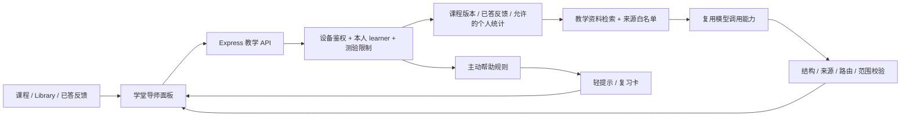

# 学堂 × Spoonie AI 导师实施方案

制定日期：2026-10-08（Australia/Sydney）。本轮已按A0→A1→A2→A3→A4推进：**三步功能已实现并通过开发验证，A4真机／独立审核／生产发布待完成**。

用户已授权完整实现三步。本文保留原设计与验收要求；实际字段、接口、实现调整及证据以 [AI_TUTOR_API_CONTRACT.md](AI_TUTOR_API_CONTRACT.md) 和 [AI_TUTOR_STATUS.md](AI_TUTOR_STATUS.md) 为准。六表、RPC、组件已存在；教材/模板独立审核仍pending。开发验证不能代替原生验收或发布。

交接入口：[AI_TUTOR_HANDOFF.md](AI_TUTOR_HANDOFF.md)。实际进度：[AI_TUTOR_STATUS.md](AI_TUTOR_STATUS.md)。旧学堂的 P5 真机验收与独立内容审核继续保留，不因新增 AI 规划而视为完成。

## 1. 产品目标与固定基准

让用户在学堂内完成「阅读 → 提问 → 理解 → 练习 → 测验 → 针对薄弱知识复习」的学习过程。Spoonie 使用同一角色形象，在冰箱中提供库存协助，在学堂中提供教学协助。

- 项目主线仍是 **UN SDG 13 — Climate Action，尤其 13.3 气候教育**。
- 内容围绕 waste：减废、材质、分类、包装污染、地方收集、重复使用、采购规划、储存安全、气候数据及证据。
- 保留独立「学堂 / Learn」主 Tab，内部 Learn、My path、Library 与现有课程路径。
- 沿用已批准的五页布局和 `learningTheme.ts`；增加轻量入口、辅导面板和复习卡，不重新设计整套页面。
- 个人学习身份、首次答案、服务端评分、80% 通过和永久解锁规则保持权威。AI 回答、阅读、额外练习都不能自行升级。
- 所有三步均为实施范围；按依赖逐步交付，不能在第一步完成后把后两步标成可选或已完成。
- 首版同时支持中英文；来源标题可保留官方原文，解释与界面跟随用户语言。

## 2. 当前仓库事实与可复用能力

本节保留实施前的复用能力基线；本轮已核对开发/生产，新增导师文件及迁移状态见AI_TUTOR_STATUS。

| 现有能力／文件 | 已有事实 | 本项目处理方式 |
| --- | --- | --- |
| `server/src/services/assistantOrchestrator.js` | Responses API、结构化回答、来源及动作校验 | 复用模型调用模式与通用校验；教学使用独立提示词、工具范围和输出类型 |
| `assistantScope.js`、`assistantTools.js` | 范围为库存、日期、食品安全、历史、补货；新闻和一般知识目前会被拒绝 | 新建教学范围规则；不能只在客户端增加按钮，也不能扩大旧冰箱工具权限 |
| `server/src/routes/assistant.js` | 设备鉴权、私有历史、反馈与待确认库存动作 | 保留已有契约；学堂另设 `/api/learning/tutor/*` |
| `FridgeAssistantScreen.tsx`、`assistantApi.ts` | 输入、历史、回答展示、快捷操作 | 提取确实通用的展示组件；学堂单独管理会话和导航，不把库存操作带入教学 |
| `server/src/routes/learning.js`、`services/learningRoom.js` | 已有鉴权课程、状态、考试、提交与恢复接口 | 服务端解析课程／资源及本人 attempt；不用客户端传的分数或答案作依据 |
| `learning_learners` | 稳定 learner UUID，对应当前 owner device；共享 join/leave 不合并进度 | 教学私有数据以 learner 归属，不以 fridge 归属 |
| `learning_quiz_attempts`、`learning_quiz_answers` | 内容／题目快照、topicCode、不可替换首答、原子结算 | 读取已经提交的反馈；可按 topicCode 统计本人表现 |
| `LearningRoomFlow.tsx`、`LearningRoomGateway` | 页面局部栈、恢复、pending 首答、前后台对账 | 在外层接入独立 tutor controller；不把 AI 请求混入考试提交事务 |
| `learning_content_versions` | public catalog 与 private bank 分离，内容不可变、独立审核门槛 | 导师只读取公开教学资料与已授权反馈，不索引完整题库 |
| 现有 RAG | 审核后的食品安全资料检索 | 可复用检索思想和基础设施；食品安全索引与教学索引需保持范围隔离 |

既有 `assistant_conversations` 同时绑定 creator device 和 fridge，且有相关复合外键、共享合并行为。因此推荐 **独立教学存储＋共用模型能力／展示组件**，避免为了导师功能改动冰箱历史和动作权限。

当前学堂真实内容在历史记录中仍为 draft／独立审核 pending；生产发布前必须重新核对。开发导师可沿用指定开发库的既有草稿 gate，正式导师只能使用已发布、审核通过的内容。

## 3. 三步完整使用体验

### 3.1 随堂问答

| 页面 | 入口 | 自动提供的背景 | 建议快捷问题 |
| --- | --- | --- | --- |
| 学堂首页／课程目录 | 小型「问勺勺 / Ask Spoonie」入口 | 本人当前阶段与选择的课程；不传共享库存 | 我该从哪里开始？／这门课学什么？ |
| 短课详情 | 学习目标下方或正文结束处的轻量按钮 | activityCode、内容版本；段落入口可附 block index | 简单解释／举个生活例子／与 SDG 13 有何关系？ |
| Library 资料 | 摘要或正文末尾的入口 | resourceCode、版本、来源与统计口径 | 这个数字代表什么？／适用于哪里？ |
| 视频活动 | 视频外的摘要页提供入口 | 活动及文字摘要；不识别播放画面 | 帮我总结／为什么会造成排放？ |

点击入口打开学堂导师面板，标题为「勺勺 · 学习导师 / Spoonie · Learning tutor」，其下显示「正在讨论：课程／资料名称」。只打开面板不调用模型；选快捷问题或提交输入才发起生成。

用户提出「这是什么意思？」时，服务端依据验证过的当前内容定位含义。回答先简洁解释，再按需要给例子、引用及最多三个下一步按钮。资料不足时说清不足，并推荐可用资料或澄清地区。

示例：在气候课提问「食物浪费为什么和 SDG 13 有关？」→ 用该课审核来源解释生产、运输及处置的关联 → 显示来源 → 可点「举例」「阅读相关资料」。不能把通关成绩解释成实际 CO₂ 减排量。

### 3.2 测验辅导与错题复习

| 场景 | 可用辅导 | 服务端规则 |
| --- | --- | --- |
| 独立 Bin Action／practice | 分级提示、解释、生活例子 | 可使用当前本人练习题的公开内容；不修改首答，不消耗库存 |
| 正式 checkpoint 未提交题 | 当前题的 AI 求解入口关闭 | 不给模型传未提交正式题、答案、后续题或完整快照 |
| 正式题已提交反馈 | 「解释一下」「换个例子」 | 仅对该已提交题开放受限讲解意图；反馈必须从服务端读取 |
| 正式测验未完成期间 | 自由教学聊天暂停；读课仍可用 | 服务端检查本人 active checkpoint，不能通过换到 Library 或另一会话绕开自由输入限制 |
| 正式测验结束／明确 abandon 后 | 自由提问、错题讲解、复习建议恢复 | 不改变既有成绩、阶段和历史 |
| My path 历史错题 | 按题讲解和按知识点复习 | 验证 attempt 属于本人，用原冻结版本和来源 |

正式测验开始前用一句话说明「测验期间自由 AI 问答暂时暂停，提交后可查看讲解」。面板被限制时，给出「继续测验」；若用户希望恢复自由辅导，可通过明确的「结束本次测验」调用现有 abandon 逻辑并说明会结束这一轮。仅关闭页面或切 Tab 不能自动 abandon。

同一用户可能有多个阶段的 active checkpoint。规则按服务端全部 active checkpoint 评估；已答解释必须精确绑定本人 attempt＋question，不因某一题已有反馈就恢复自由聊天。受限解释只接受服务端登记的固定 intent，不接受附带任意自定义指令。

上述规则能限制应用内辅导和私有题库访问，**不能保证用户无法借助外部 AI 解题，也不能靠一句提示词保证模型绝不推断答案**。正式反馈阶段的教学解释可帮助理解概念，这是明确允许的行为。

练习提示分为：观察对象／回忆概念 → 提示判断依据 → 展开解释。提示顺序由服务端已发出的 hint level 决定，不能由客户端伪造记录。练习的已提交首答仍冻结，后续讲解不重写分数。

「练类似题」使用经过审核的教学练习模板，覆盖现有 12 个 assessment topic，至少每个 topic 一个双语模板。模板作为独立非计分练习，不复用正式题的正确答案列表，也不由模型决定标准答案。用户选择后，由服务端校验模板答案并返回解释；不计入升级、共享成就或个人薄弱统计。AI 可以解释模板反馈。动态生成并由 AI 自评的正式题不在本方案内。

### 3.3 主动帮助与个性化复习

主动帮助分两种：**规则确定何时出现帮助入口；用户接受后，AI 生成针对性的解释**。用户打开页面时，不自动生成长回答，不后台持续分析全部行为。

| 触发 | 初始规则（待真实测试后调节） | 提示／后续动作 |
| --- | --- | --- |
| 相同知识点反复错误 | 本人近 30 天、同 topic 最近 5 个去重首答中至少 2 错；排除已放弃／失效的正式 attempt | 「这个知识点容易混淆，要换个例子吗？」→ 已答解释／对应课程 |
| checkpoint 未通过 | 同一 submitted attempt 的结果页最多一张卡 | 「先复习这两个知识点」→ 最多两个有证据的 topic 和相关课 |
| 用户明确说没看懂 | 当前问题／消息为用户主动提供 | 直接换更简单的表达；不额外弹提醒 |
| 新一轮练习开始前 | 有近期薄弱 topic，且没有正在作答的正式题 | 展示一张复习推荐卡；用户自行选择 |
| 长时间停留 | 默认关闭；可在后续小范围试验开启，初始阈值为前台连续 90 秒且可交互 | 只问「需要一个例子吗？」；不称用户有困难，不写入薄弱统计 |

重复错题信号在练习反馈和正式测验结束后展示，不在未提交正式题、选项触摸、提交 pending 或视频播放时出现。结果页和 My path 使用同一服务端推荐，不各自弹出重复卡。

提示初始频率：每次课程访问最多一次、同 topic 拒绝后 24 小时不再主动提示、跨页最短 5 分钟间隔、每个本地日最多三次。日界按明确的用户时区处理，只用于频率，不能推断 council。服务端以 ruleVersion＋learner＋topic／attempt 的去重键约束，客户端另防止同一次 render 重复显示。

默认允许静态复习卡和轻量主动提示，首次出现提供「关闭主动提示」操作；设置中可随时关闭。基于个人历史的推荐单独有开关；关闭后不使用历史错误构造回答或主动推荐，当前题的明确提问仍可讲解。停留时间提示单独默认关闭。所有开关由服务端保存，离线／无法读取偏好时不主动提示。

停留时间仅在当前页面可见、App active、视频／输入／面板／网络等待均未占用时累计；切页、后台、屏幕阅读器使用等情形取消或禁用该实验。原始触摸轨迹、键盘内容和连续停留日志不上传。

## 4. 薄弱知识判断与推荐

初版使用可以解释的统计，不让模型自主判定「掌握／不会」。服务端从本人权威答案 join 题目冻结 snapshot 的 topicCode 聚合，不信任客户端上传的 correctCount、困难标签或知识画像。

- 正式统计使用 submitted checkpoint／review／mixed-review 的首答；未完成、abandoned、invalidated 不进入正式推荐。Bin Action practice 的已提交题可单独作为练习信号，不能和正式分数混成一个等级。
- 一个 answer 只计一次，HTTP 重试不增加样本。同一 questionCode 在同一日反复练习，薄弱分析仅使用最近一次有效首答；历史成绩原样保留。
- 当前版本题目标记与历史 topic 的对应由 manifest 明确映射；无法兼容的版本分开显示，不强行合并。撤回版本从当前推荐样本排除，但本人已结算历史可阅读。
- 显示 sampleCount、wrongCount、观察窗口与「建议复习」，不把少量答题转化为能力评分；不足两个有效样本时标记证据不足。
- 初始排序：近五个有效样本错误数 → 最近错误时间 → 固定 topic 顺序。最多推荐两个 topic；统计口径和 ruleVersion 必须随结果记录。
- 每个 topic 映射到现有 activity／resource 和审核练习模板。AI 只能解释这些推荐；不能发明课程、解锁路径或未登记资源。
- 用户之后连续答对两个有效去重样本时停止该 topic 的主动错误提醒。统计仍可在本人复习页查询，不宣布永久掌握。

学习记录由原系统保存；首版按需聚合，小数据量不新增一张重复画像表。性能不足时再用新 migration 增加索引／物化缓存并明确失效与重算策略。

## 5. 视觉与交互规格

| 部分 | 规格 |
| --- | --- |
| 背景／文字 | `#F7FBFA`、白色面板、`#173D31`；辅助小字用既有可读性变体 |
| 强调 | 绿色状态与来源、橙色发送／继续；白字按钮沿用 `actionOrangeReadable`，不直接换回低对比色 |
| 入口 | 小 Spoonie 头像／图标＋短标签，保持至少 44pt 触摸范围；不覆盖底部导航 |
| 面板 | 初始约 60% 可用高度，可展开；键盘显示或大字体时可使用完整可用高度，正文和历史可滚动 |
| 内容 | 课程背景标签、短段落、可折叠来源、最多三个下一步操作；建议先解释再举例 |
| 主动提示 | 页面内小卡／一行提示，提供接受和关闭；不遮挡选项，不自动展开对话 |
| 来源 | publisher、标题、地区、内容日期／统计观察年份；打开登记的 HTTPS 来源 |
| 会话 | 新对话、本人历史、清除历史；课程切换时显示背景变化，不能悄悄沿用另一课的指代 |
| 无障碍 | 中英文、320 宽度、字体 1.3／1.6、读屏标签、焦点进入／退出恢复、Reduce Motion |

导师作为学习页面上层的独立容器，关闭时原课程滚动位置与已选答案仍保留。面板打开时背景学习页面不接收触摸；Android 返回先关闭面板，再返回局部页。Library 横向筛选、导师历史横向操作和底部主导航不得联动。

实现优先复用现有 Modal／动画依赖，是否增加 bottom-sheet 库在 A0 核对 Expo 57 兼容性后决定。不得为规划先安装依赖或整体迁移 Expo Router。面板滑动与课程边缘返回需要独立手势范围，不能恢复 `gesture.x0 <= 24` 的旧 capture 判断。

视频全屏播放时不叠加导师；返回视频摘要页后可问。切离 Learn 或后台时撤销当前 UI 请求和计时器，保留服务器已完成消息；再次进入按服务端恢复。

## 6. 技术架构与上下文边界

客户端传内容标识，不传正文权威副本、learnerUid、fridgeUid、score、correctOptionId 或自由 system prompt。服务端重读对应课程／资源、本人 attempt、偏好及版本。

每个教学会话绑定 context kind＋具体 entity＋contentVersion。单题讲解还绑定 attemptUid＋questionUid；自由问答与受限讲解会话分开。切换内容建立或恢复匹配上下文的会话，不把上一课的「这个」当作本课事实。

当前模型供应商／模型配置沿用服务端配置，不在客户端出现 API key。抽取通用 provider client 与结构化展示时，冰箱范围及动作仍按其原规则验证；不要把教学 source／action 混进旧 assistant schema。

发给模型的内容为：教学指令、限定历史、当前公开课程片段、检索证据、明确授权的已答反馈或聚合统计。**禁止把整个 learningRoom 服务 `content()` 返回对象交给模型**：该对象目前还含 private bank。

Tutor 无库存写工具、pending inventory action 或 checkpoint finish 工具。建议导航仅为应用内白名单，所有目标必须存在于允许内容版本，不能执行模型自由 URL、HTML 或脚本。

## 7. 教学知识与版本

新增版本化 tutor manifest，绑定 `learning_content_versions.content_hash`。记录公开知识分块、topic→activity/resource 对应、双语快捷问题、审核练习模板、template 来源、reviewer／reviewedAt／hash 和发布时间。

基础资料直接来自 public catalog 的 activities、resources、sources；视频先使用现有文字摘要。lesson 没有独立 topicCodes 的部分通过 manifest 显式映射，不靠标题猜知识点。

第一版检索使用「当前实体优先＋topic／地区过滤＋双语词汇／关键词排序」，返回有限片段。教学语料较少，可先避免重新搭向量库；用评估证明覆盖不足后再复用 embedding／混合检索，新增教学 namespace／过滤与 migration，不放宽现有食品安全搜索条件。

- 切分按学习正文块，保留 sourceRefs、contentVersion、region、发布日期、测量年份与统计边界；引用不来自模型自行编造。
- 仅索引公开正文；正式题库、题目快照、答案和教学模板答案不进入一般检索。
- 正式已答解释临时读取这一题的冻结反馈与来源；不读取同 attempt 其他未答题。必要的模型数据先做显式白名单投影。
- 教学模板的答案只用于服务端练习判定及已提交练习讲解；不能出现在未答模板的公开 payload。
- 当前课程用所请求的可用版本；历史答案用 attempt 原版本。新课程发布后旧会话不得默默切换证据。
- 撤回版本停止生成新教学回答／推荐；历史已保存回答仍显示日期和撤回提示，来源打开须再次校验。本人已结算题仍可查看原固定反馈。
- manifest 发布需内容负责人审核；新增模板需要真实独立审核。开发草稿仅在既有指定开发 gate 内使用。
- 本方案不自动实时搜索新闻。回答「最新」问题时说明当前资料日期；实时检索若后续引入，应另做官方域名、地区、日期和审核契约。

分类规则未知 council 时，说明课程示例范围，并询问适用地区。首版仅支持 global／AU／AU-VIC／AU-NSW；可临时讨论用户给出的 council 名称，但无审核资料时不承诺具体服务，不能把自由文本 council 当作已支持地区代码。

## 8. 计划中的数据库设计

推荐新增下列六张表；A0 冻结具体字段、复合外键和 RPC，之后才能写 migration。数据库 source of truth 仍为实际 SQL。

| 表 | 关键字段／用途 | 约束重点 |
| --- | --- | --- |
| `learning_tutor_manifests` | manifest version、contentVersion／contentHash、knowledge／topicMap／practiceTemplates、审核元数据、status | 已发布正文不可变；发布审核门槛；内容撤回停止使用 |
| `learning_tutor_conversations` | conversationUid、learnerUid、context kind／entity／version、状态、createdAt／expiresAt | 本人私有；上下文绑定；默认 30 天有效；不能用 fridge ownership |
| `learning_tutor_messages` | conversationUid、learnerUid、role、受限正文／structured payload、引用快照、时间、评价 | 同 learner 会话复合外键；引用版本保留；评价只针对 assistant 消息 |
| `learning_tutor_requests` | learnerUid、requestKey、payloadHash、conversationUid、状态、lease、response／usage | learner＋requestKey 唯一；同键不同 payload 拒绝；跨实例并发 claim |
| `learning_tutor_preferences` | learnerUid、proactiveEnabled、personalizedEnabled、dwellHintsEnabled、频率时区 | 服务端默认与校验；不复用共享通知开关 |
| `learning_tutor_interventions` | learnerUid、ruleVersion、topic／attempt、dedupeKey、reason、状态、时间 | 本人私有；去重／限频；不保存原始行为轨迹 |

初版评价可作为 messages 上的本人唯一 rating／reasonCode，不另建表；若需要多人审核评价，后续另设计。统计按现有首答查询，不另外复制正式答案。

所有新表启用 RLS，撤销 anon／authenticated 权限。为了与 learning 既有契约一致，service role 直接 SELECT，写入通过服务端专用 RPC；RPC 内再次解析 device→learner 并验证消息／attempt／来源归属。请求 lease、完成消息与回复写入应事务化，不能靠 Express 进程内 Map 保证幂等。

设备恢复有一个重要依赖：当前 `transfer_learning_with_membership()` 会合并 temporary learner 并删除该行。新增表引用 learner 后，必须在新 migration 中扩展这个函数，**在删除 temporary learner 之前迁移导师数据**，不能只增加一个无顺序保证的 after trigger。

恢复策略：保留原 learner；临时会话／消息转归原 learner；幂等键冲突加 recovery namespace；关闭旧设备进行中的 request lease；原身份偏好优先，提示频率保留更严格的冷却，按迁移后的数据重新聚合。恢复后的新设备可以读取本人历史，旧 credential 不可访问。join／leave 不迁移或合并导师身份。

新 schema、RPC、权限、索引、内容 reference 数据及恢复行为全部用新的 timestamped migration 保存并提交 Git。不得修改现有已应用 learning／assistant migration，不能只改 Dashboard。开发／测试先应用并验证同一份文件，生产按依赖顺序应用。

## 9. 计划中的 API 契约

以下保留设计接口清单，实际已实现字段及命名见AI_TUTOR_API_CONTRACT。继续使用Device-ID＋Device-Credential鉴权，服务端解析本人learner，不新增账号登录。

| 接口 | 输入／输出重点 | 阶段 |
| --- | --- | --- |
| `POST /api/learning/tutor/messages` | message 或 fixed intent、language、conversationUid、requestKey、context 标识；返回结构化回答及来源／动作 | A1；A2 扩展受限意图 |
| `GET /api/learning/tutor/conversations` | 本人未过期会话，分页、context 筛选 | A1 |
| `GET /api/learning/tutor/conversations/:uid` | 本人消息／来源快照／评价；不返回内部 prompt 或 request audit | A1 |
| `DELETE /api/learning/tutor/conversations/:uid` | 幂等删除本人会话、消息和相关正文缓存 | A1 |
| `DELETE /api/learning/tutor/history` | 清除全部本人导师对话；保留正式学习成绩 | A1 |
| `PUT /api/learning/tutor/messages/:uid/feedback` | useful／not_useful 和登记的 reasonCode | A1 |
| `GET/PATCH /api/learning/tutor/preferences` | 三个帮助开关和频率时区；未知字段拒绝 | A3 |
| `GET /api/learning/tutor/recommendations` | evidenceVersion、统计口径、最多两个 topic 和登记的课程／练习目标 | A2／A3 |
| `GET /api/learning/tutor/practice/:templateCode` | 本版本公开教学模板，不含标准答案 | A2 |
| `POST /api/learning/tutor/practice/:templateCode/answer` | 版本、optionId；服务端返回固定教学反馈，不计升级 | A2 |
| `POST /api/learning/tutor/interventions/claim` | 页面 entity 标识／候选 reason；服务端验证条件与冷却，返回一张固定提示或 null | A3 |
| `POST /api/learning/tutor/interventions/:uid/respond` | shown／accepted／dismissed；状态机校验；接受后再由用户触发 message | A3 |

`context` 使用判别类型：general／course／activity／resource／submitted-question／practice-template。所有内容型 context 带 contentVersion；submitted-question 带本人 attemptUid＋questionUid；客户端传的状态和任意正文不能覆盖服务端背景。需要更改 context 时换会话，或者通过明确的转换流程创建新会话。

输出建议字段：conversationUid、messageUid、answer、sources、suggestedActions、contextLabel、contentVersion、manifestVersion、answerStatus、fallback。来源必须来自本次服务端证据。动作白名单为 ask_prompt、open_lesson、open_resource、open_practice、resume_attempt；是否可用由服务端当前考试状态决定，模型最多提出三个经过复核的动作。

正式 active checkpoint 期间，messages 只允许已答题的 `explain`／`simplify`／`example` intent；无自由 message 字段，后续 ask_prompt 同样只能映射到固定 intent。测验结束后才允许自由跟进。

计划稳定错误码：`tutor_disabled`、`tutor_context_invalid`、`tutor_conversation_not_found`、`tutor_assessment_restricted`、`tutor_feedback_not_available`、`tutor_content_unavailable`、`tutor_content_changed`、`tutor_request_conflict`、`tutor_request_pending`、`tutor_unavailable`。鉴权／限流沿用通用 401／429，限流返回 Retry-After。未知 context、额外 learner／score／prompt 字段、跨人消息／attempt 必须拒绝。

## 10. 请求、失败和费用控制

- 生成请求沿用公共 provider 能力；助手与导师共用设备 AI 总额度，避免新路由绕过原有预算。具体默认值实施时从配置读取，教学可另有较低子额度。
- 面板加载、固定提示、统计推荐、模板判分、来源查看和评价不调用模型。固定提示只有用户接受并发送后才生成解释。
- 同一 requestKey＋payloadHash 重试，完成则读原回复，pending 则返回等待状态；失败允许显式重试。客户端不要每次网络重试生成新 key。
- RPC claim 租约仅限制数据库请求状态；供应商已完成但响应丢失时仍可能产生额外模型费用。不得声称跨数据库／模型请求严格 exactly-once；记录 uncertain 状态并限制盲目重试。
- 服务端保存回复前重新核对所有权、content 状态与 request lease。身份恢复／撤回发生在生成期间时，旧请求不能写回错误身份或失效版本。
- 初始生成 deadline 约 30 秒，完整客户端等待约 40 秒；具体取值按既有 API／部署限制核对。晚到响应只恢复到对应会话，不能弹回已离开的页面。
- 客户端取消仅撤销 UI 等待并尝试中断网络；不能保证供应商不计费。服务器完成的同键回复允许回来后恢复。
- 无网络或模型失败：保留输入，展示重试；已提交错题的固定解释和课程阅读继续可用。不能把兜底模板标为 AI 已成功生成。
- 会话历史设消息／token 上限，保留有限最近轮次；source retrieval 限片段数量。每次记录模型、token、latency、status 和版本，日志不打印 credential、原始 provider 请求或全部聊天。
- 月费用按「生成次数 × 每次平均输入／输出 token × 当前模型费率」估算；若开启 embedding 另计。A1 试用后给实际基线，不在计划中凭空承诺费用。
- 设置 tutor、assessment coaching、proactive 三个服务端 feature flags。关闭 AI 不影响学堂读课与权威考试；主动提示可单独停用。

## 11. 保存、清除与用户控制

导师对话与正文默认保存 30 天；请求中的完整回复缓存不超过会话有效期。最小脱敏请求审计和提示状态建议最多 90 天，用于费用、失败和频率分析。正式考试历史遵守原学习契约，不因清除导师聊天而删除。

「清除导师对话」必须同时清除 messages、request response 正文和任何 transcript 摘要，不能只从列表隐藏。可保留不含正文的 request key tombstone 防止旧重试重新生成已删除会话。清除时活动请求作废，迟到回复不得重建历史。

主动帮助、个人历史推荐和停留提示分别可关闭。个人推荐关闭时不会删除原考试记录；界面解释其影响，服务端不再把这些历史作为模型上下文。正式产品需要确认并实现定期清理机制，不能只有 expiresAt 字段却永久保留正文。

本阶段只做学堂内帮助，不新增系统 Push、邮件、后台唤醒或共享家庭提醒；不采集连续手势／键盘轨迹，不读取额外库存来预测学习困难。

## 12. 文件与模块分工（计划）

| 位置 | 工作 |
| --- | --- |
| `src/types/learningTutor.ts` | context、回答、动作、建议、偏好、请求状态类型 |
| `src/services/learningTutorApi.ts` | 鉴权 HTTP、requestKey、错误映射；不直连 Supabase |
| `src/components/learning/tutor/` | 入口、导师面板、消息／来源展示、主动提示、复习卡、教学模板视图 |
| `src/components/learning/LearningRoomFlow.tsx` | 页面 context、面板生命周期、局部导航白名单；考试 gateway 保持独立 |
| `src/components/learning/LearningQuizScreen.tsx` 等 | 已答解释按钮、正式限制提示、练习 hint 和结果复习入口 |
| `src/components/assistant/`（如必要） | 从冰箱助手提取通用展示组件；必须补原功能回归 |
| `src/i18n.tsx` | 导师双语 UI、固定提示与失败文案；保留他人的并行修改 |
| `server/src/routes/learningTutor.js` | 严格输入类型、鉴权、限流、状态码 |
| `server/src/services/learningTutor*.js` | scope、context 投影、检索、编排、结构／来源校验、推荐与提示规则 |
| `server/data/learning-tutor/` | 版本化 manifest／topicMap／双语教学模板／审核记录 |
| `server/scripts/`、`server/test/` | manifest validator、migration generator、接口／模型评估与真实开发验证 |
| `supabase/migrations/` | 新的持久化／恢复／内容／规则迁移；不改已应用文件 |
| `docs/data-architecture/BACKEND_DATA_CONTEXT.md` | 实际数据契约变更发生时同步，而非把计划表名写成已部署事实 |
| `docs/learning-room/verification/<日期>/` | 分阶段 API、截图、设备、性能及评估证据 |

本次只生成计划和交接文档。上述模块、API、表、feature flags 与测试尚未创建。

## 13. 分阶段实施任务与完成条件

### A0：冻结契约与准备基线

1. 重读 AGENTS、全部 BACKEND_DATA_CONTEXT、Expo v57 精确文档、现有 learning／assistant migrations 及恢复函数；检查最新工作区与环境。
2. 核对原学堂 P5 和独立审核状态，不撤掉已有门槛；记录开发／生产 migration 实际版本。
3. 冻结 context、正式期间限制、六表／RPC、恢复合并顺序、manifest 与响应 schema；写 API_CONTRACT 的 AI 扩展文档。
4. 把现有 12 个 assessment topic 映射到课程／资料，梳理地区、食品安全、数据年份和缺失来源。
5. 画出／实现明确开发预览的导师面板布局：课程、已答反馈、结果推荐和错误状态；不生成新素材，不把 fixture 当真实 API。
6. 固定模型评估样例与成本／延迟记录格式；检查依赖后选面板实现。

完成条件：类型／接口／归属／恢复方案可实现，12 topic 映射有记录，UI 增量规格可对照，开发与生产状态明确。不能把“已设计”记成“已上线”。

### A1：第一步——随堂问答及私人会话

1. 新增 foundation migration：manifest、conversation、message、request 表、RLS／RPC、恢复扩展与清理策略；在开发验证。
2. 制作公开教学 manifest 和检索器，保留来源、地区／年份；完整私有 bank 不进入模型。
3. 实现 tutor scope／模型编排／来源和动作验证；加入 active checkpoint 限制，即使 A2 尚未做也不能允许任意解题。
4. 接入课程、Library、学堂首页和视频摘要入口；只在明确发送时生成。
5. 实现本人历史、新对话、评价、清除、同键重试、前后台／切页恢复和失败兜底。
6. 通过相关类型／服务端／数据库与真实开发 API 验证；做原冰箱助手回归。

完成条件：两个语言均可基于正确页面回答并引用，跨人访问被拒绝，网络丢失不重复落消息，清除与恢复成立，冰箱助手原功能无回退。记录原生尚未通过的项目。

### A2：第二步——测验讲解与针对性复习

1. 加入本人已答 feedback context 投影；固定解释／简化／举例 intent，旧 attempt 用冻结来源。
2. 接入 checkpoint 已答、历史错题和 practice 的分级提示；后端拒绝伪造反馈和未答正式题。
3. 明确退出并结束当前 attempt 的入口；仅关面板／页面不改考试状态。
4. 为 12 个 topic 制作至少一个独立双语教学模板，登记答案／来源／审核；实现非计分模板获取和判定。
5. 实现服务端薄弱统计、topic 映射与结果页／My path 最多两个复习推荐。
6. 追加 manifest／RPC／索引所需 migration 和文档；正式模板发布须真实独立审核。

完成条件：提交前／提交后／结束后的权限差异可验证；升级门槛与首答完全不受 AI 影响；历史解释不漂移；额外练习不产生真实库存／XP／升级；薄弱依据可追溯到本人首答。

### A3：第三步——主动帮助与偏好

1. 新增 preferences／interventions migration 和原子 claim／respond RPC，补恢复、去重、限频和定期清理。
2. 接入反复错误、未通过结果和练习前复习卡；用户主动说没看懂由正常对话处理。
3. 实现接受／拒绝／关闭／冷却状态和主动帮助设置，关闭后服务端与 UI 均遵守。
4. 停留提示代码可实现但默认关闭，用 feature flag 在明确开发试验中验证；不依赖该信号判断薄弱或上线启用。
5. 验证无模型被后台自动调用，跨实例、切页、重启、重复响应不重复提示。
6. 完成频率／帮助接受度／有用评价观测；数据不足不宣布个性化已经提高通过率。

完成条件：全部核心触发可控、可解释；正式答题不会被打断；偏好和冷却随本人恢复；拒绝后不反复出现；关闭主动帮助仍可正常主动问答。

### A4：整体设备验收与发布

1. Android／iOS 真机验证 keyboard、底栏、Library 横滚、边缘返回、Modal／视频、后台／杀进程恢复、读屏及字体 1.3／1.6。
2. 重跑与变更有关的现有 learning、assistant、scope、history 和恢复验证，导出 Android／iOS bundle；检查后端文件追踪没有引入前端 TS／素材。
3. 使用真实模型跑固定教学评估，独立审核内容／模板；验证 stale／withdrawn、地区不明、食品安全和限流失败。
4. 在开发环境应用并验证所有最终 migration；重新读取生产依赖和配置，再按实际授权完成发布步骤。
5. schema → reference／manifest → Express → App 顺序部署；小范围启用问答、测验辅导、主动提示三个开关。
6. 回退通过 feature flags／应用版本，保留已写学习记录；数据库修正用追加 migration，不做生产 reset 或删除新表回退。

完成条件：三步均实现，功能、真实设备、审核、部署各自有证据；未完成的生产发布或设备条件明确标 pending，不能用 Web 预览／模拟模型替代。

依赖顺序：A0 → A1 → A2 → A3 → A4。本轮已获实现及开发库验证授权并完成三步开发；原学堂独立审核／P5继续pending。A4设备、独立审核和生产发布逐项保留实际门槛，不承诺尚未验证的日期。

## 14. 测试与验收矩阵

| 分类 | 必须覆盖的代表情景 |
| --- | --- |
| 知识正确性 | SDG 13／13.3；food loss＋waste 范围；统计发布年与观察年；use-by 不能由减废目标覆盖；地区／council 不明 |
| 上下文 | 当前课程／资料指代；换课不串上下文；错题原版本；视频摘要；未知标识；无足够证据 |
| 模型范围 | waste 相关提问、翻译教学术语、简化课程；无关任务拒绝；来源／用户／历史中的诱导指令作为数据 |
| 题库隔离 | 公开学习 payload 和模型输入均无完整 bank／future snapshot；未答正式题请求拒绝；受限 intent 无自由附加 message |
| 学习权威 | AI 前后首答、正确数、解锁、库存、成就值均相同；额外模板不计正式分；finish 原子事务未改变 |
| 身份 | 两成员同冰箱互不能读导师记录；join／leave 个人数据不混；恢复合并与旧 credential 撤销；同时恢复／生成 |
| 幂等与失败 | 同键相同／不同 payload、并发 lease、返回丢失、超时、限流、清除中生成、版本撤回中生成 |
| 主动提示 | 阈值边界、少量样本、同题反复、去重、24h 拒绝／5min 间隔／每日额度、多个 active checkpoint、关闭偏好、background |
| 原生 UI | 两语言、小屏、键盘、scroll／底栏隔离、返回优先级、面板展开、动态字体、读屏、Reduce Motion |
| 生产依赖 | 真实 published 内容、审核 manifest、模型配置、清理机制、迁移顺序、禁用开关、Vercel 后端文件追踪 |

固定模型评估初始至少 60 条，覆盖以上主要教学／范围／地区／测验场景，中英文均有；至少 10 条用于来源不足、未知地区或提示注入。常规 CI 用结构与规则测试、模拟 provider；实际模型评估单独运行并记录模型和 prompt／manifest 版本。

强制程序边界：跨人访问、未答题私有字段泄露、非法来源／路由、AI 改成绩、重试重复落库等必须全通过。真实模型不能以这类程序测试替代事实审查；固定集合目标为课程事实／引用正确率至少 95%，所有关键食品安全和 SDG 错误必须修复后才能发布。

性能先记录真实 p50／p95。初始体验目标：普通回答 p95 在 15 秒内；超过约 8 秒显示仍在处理；达到 deadline 明确失败并可重试。它是验收目标，不是已测性能或供应商保证。正常发送不同时刷新整个学堂状态。

观察指标：问答有用评价、来源打开率、提示接受／拒绝率、重复打扰、回复耗时、错误率、平均 token／费用及后续复习。试用期间把复习后的成绩变化作为观察数据；要证明学习提升需后续对照设计，不能直接把通过率变化归因于 AI。

已有检查入口可核对：`npm run learning:test`、`npx tsc --noEmit`、`npm --prefix server run verify:learning-room`、`verify:learning-gateway`、`verify:assistant-scope`、`verify:assistant-history`。Tutor 新测试／验证命令在实施时新增；只运行与具体变更和失败相关的检查，文档规划阶段无需跑全套 App 测试。

## 15. 持续交接与阶段报告

每个工作包结束更新 AI_TUTOR_STATUS：实际文件、migration 名称和应用环境、接口变化、检查结果、设备与内容审核状态、剩余任务。数据契约改变时同步 BACKEND_DATA_CONTEXT。若用户后续说「继续」，从状态文件指定的下一任务接手，不从生成新效果图或重构导航重新开始。

保留旧学堂 P5 的待验事实。所有新功能完成后才将三步标为完成；生成计划、写测试、使用开发 fixture、模型模拟或代码编译都不能代替真实实现／设备／审核／部署证据。

## 16. 参考与依据

- 当前实现依据：本计划第 2 节列出的本地源码、`20261005010000_learning_room_assessment.sql`、现有 assistant migrations、完整 BACKEND_DATA_CONTEXT 及学堂内容／视觉／API 文档。
- 版本约束：已于本轮读取 [Expo SDK v57 文档](https://docs.expo.dev/versions/v57.0.0/)，该版本对应 React Native 0.86、React 19.2.3。使用特定模块时仍需读取其精确版本页面。
- 教学 AI 验证方法参考 [OpenAI Evaluation best practices](https://developers.openai.com/api/docs/guides/evaluation-best-practices)：按具体任务和边界建立评估并随迭代验证。本文的样例数量、阈值和阶段安排是项目方案，不是官方强制指标。
- 上下文选择参考 [OpenAI Optimizing LLM Accuracy](https://developers.openai.com/api/docs/guides/optimizing-llm-accuracy)：提供与任务有关的知识，并验证检索效果。本文的教学／冰箱隔离与 manifest 设计源于本项目现有数据边界。
